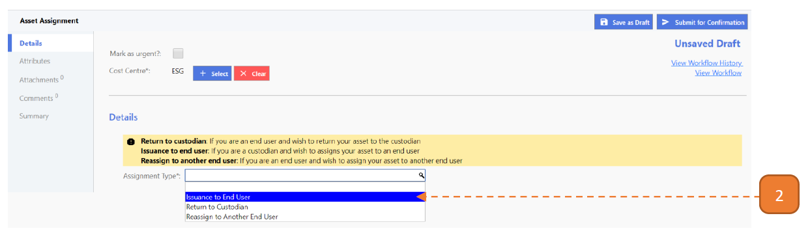

# For Custodians

## How do I Assign an Asset to an End User?

> Navigate to: **Asset > Asset Assignment**.

1. Select **New**.

2. Select the **Assignment Type** as “Issuance to End User”.

3. Select the “New Assigned End User”.

4. Search for the user using the search box.

5. Go to the right user and select with the button, you may only select one user.

6. Select the **List of Assets** with the **Add** button.

7. Search for the asset using the search box.

8. Check the right asset. You may select more than 1 asset.

9. Select the **Submit For Acknowledgement** and **Confirm** button.

