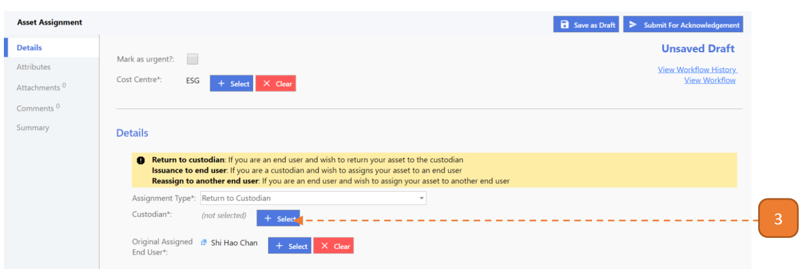
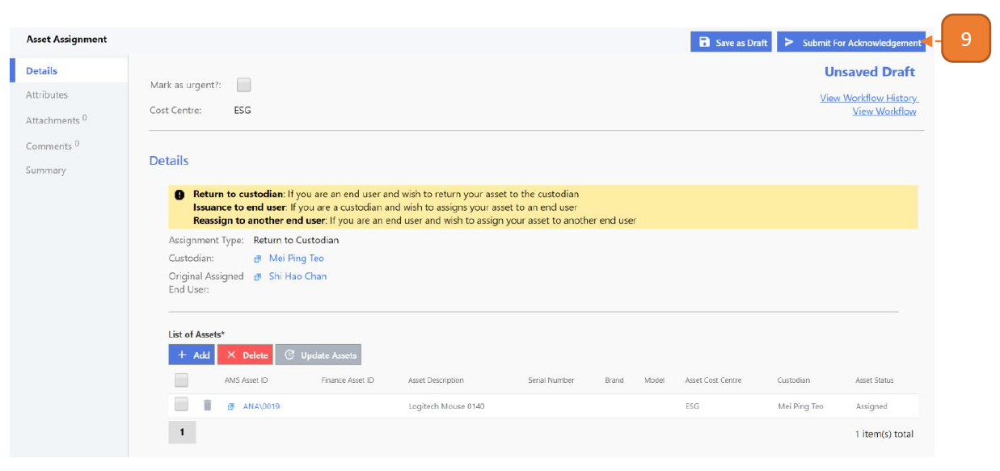

# For End Users

## How do I Return an Asset to a Custodian?

> Navigate to: **Asset > Asset Assignment**.

1. Select **New**.

2. Select the **Assignment Type** as “Return to Custodian”.

3. Select the **Custodian** of the asset.

4. Search for the user using the search box.

5. Go to the right user and select with the button, you may only select one user.

6. Select the **List of Assets** with the **Add** button.

7. Search for the asset using the search box.

8. Check the right asset. you may select more than 1 asset.

9. Select the **Submit For Acknowledgement** and **Confirm** button.

## How do I Reassign an Asset to another End User?

> Similarly, Navigate to: **Asset > Asset Assignment**.

1. Select **New**.

2. Select the **Assignment Type** as “Reassign to Another End User”.

3. Select the **Custodian** of the asset.

4. Search for the user using the search box.

5. Go to the right user and select with the button, you may only select one user.

6. Select **New Assigned End User**.

7. Search for the user using the search box.

8. Go to the right user and select with the button, you may only select one user.

9. Select the **List of Assets** with the **Add** button.

10. Search for the asset using the search box.

11. Check the right asset, you may select more than 1 asset.

12. Select the **Submit For Confirmation** and **Confirm** button.

