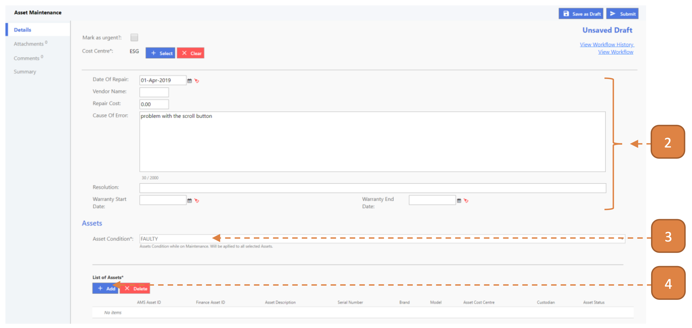

# For Custodians

## How do I Start an Asset Maintenance?

> Navigate to: **Asset > Asset Maintenance**.

1. Select **New**.

2. Enter the maintenance details where applicable.

3. Select the **Asset Condition**.

4. Select the **List of Assets** with the **Add** button.

5. Search for the asset using the search box.

6. Check the right asst, you may select more than 1 asset.

7. Select **Submit**.

## How do I Start an Asset Maintenance Using Excel Upload?

> Navigate to: **Asset > Asset Maintenance**.

1. Select **Download Upload Template File**. 
An excel workbook will be downloaded. 
If the button is unavailable, notify your agency admin.

2. Open the Excel workbook. 
On the **Asset Maintenance** worksheet:

- **Cost Centre:** This is the maintenance’s cost centre. 
Refer to **Master Data** worksheet for available options.

- **Asset Condition**: What is the condition of the asset. 
Refer to **Master Data** worksheet for available options.

 **Note:** Only one row should be indicated.

 

3. On the **Asset** worksheet:

- **AMS Asset ID:** The ID of the asset concerning the current maintenance.

4. Browse for the workbook and select **Upload**.

Once the upload is confirmed, the system will check the Excel records for errors. 
When this validation is complete, a summary is shown.

5. If **no critical errors/warnings are found,** select **Confirm to Proceed**.

6. Otherwise, select **Download Validated Excel**.

- The first 2 columns on the validated worksheet will describe the critical errors/warnings that is present in the line item such as “[AMS Asset ID] cannot be found.”

7. A transaction will be created in the search page as **DRAFT**.

## How do I Complete an Asset Maintenance?

> Navigate to: **Home**. View your inbox, these are all your **pending tasks**.

1. Select the transaction for your completion by selecting the link in **blue**. 

- In this case, it’s #00000001.

2. Select **Complete**.

