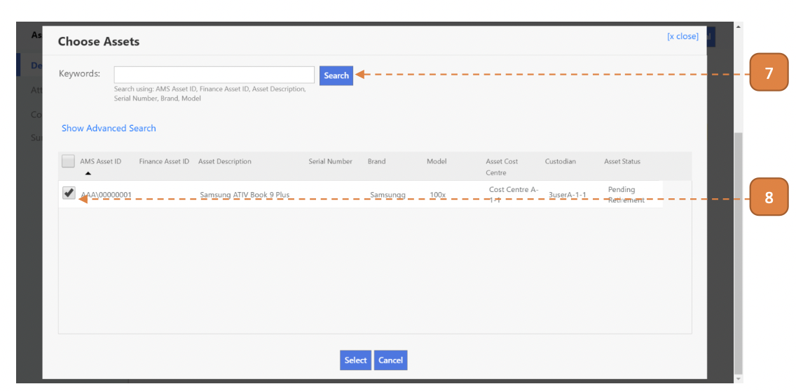
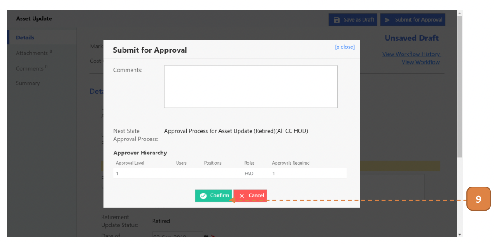

# For Custodians

## How do I Retire an Asset (Pending Retirement)?

> Navigate to: **Asset > Asset Update**.

1. Select **New**.

2. Select **“No”** for **Update Interfaced Asset**.

3. Select **“Yes”** for **Update for Retirement**.

4. Select **“To Decomm”** for **Retirement Update Status**.

5. Select the **“List of Assets”** with the **Add** button.

6. Search for the asset using the search box.

7. Check the right asset, you may select more than 1 asset.

8. Select **Submit for Approval**.

9. Select **Confirm**.

## How do I Retire an Asset (Retired)?

**Note that only Assets with "Pending Retirement" Asset Status can be selected for retirement.

> Navigate to: **Asset > Asset Update**.

1. Select **New**.

2. Select **“No”** for **Update Interfaced Asset**.

3. Select **“Yes”** for **Update for Retirement**.

4. Select **“Decomm/Disposed”** for **Retirement Update Status**.

5. Select the retirement date for **Date of Retirement**.

6. Select the **“List of Assets”** with the **Add** button.

7. Search for the asset using the search box.

8. Check the right asset, you may select more than 1 asset.

9. Select **Submit for Approval**.

10. Select **Confirm**.

