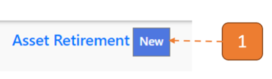
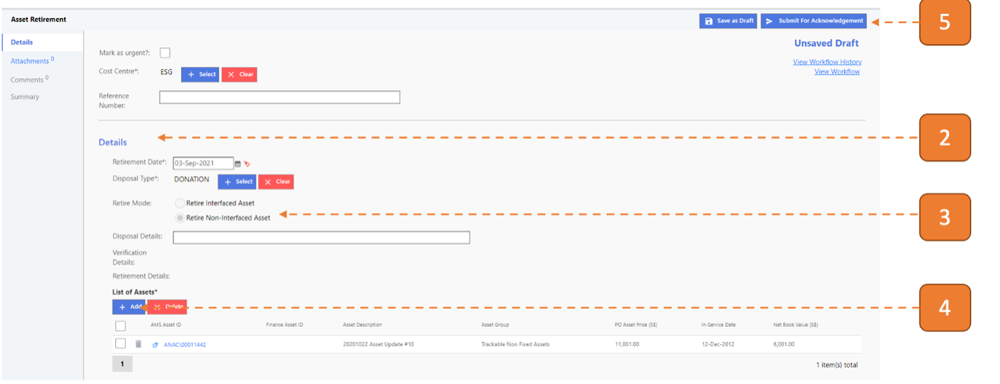
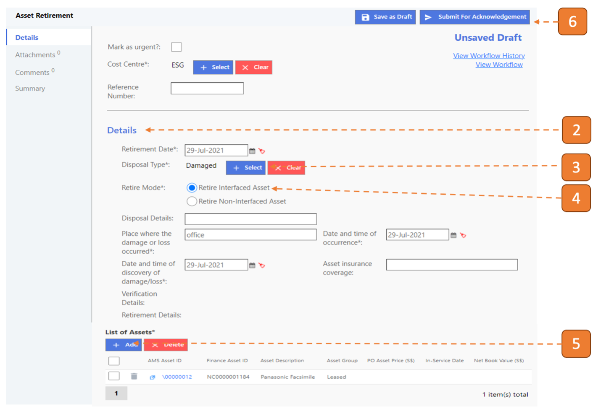
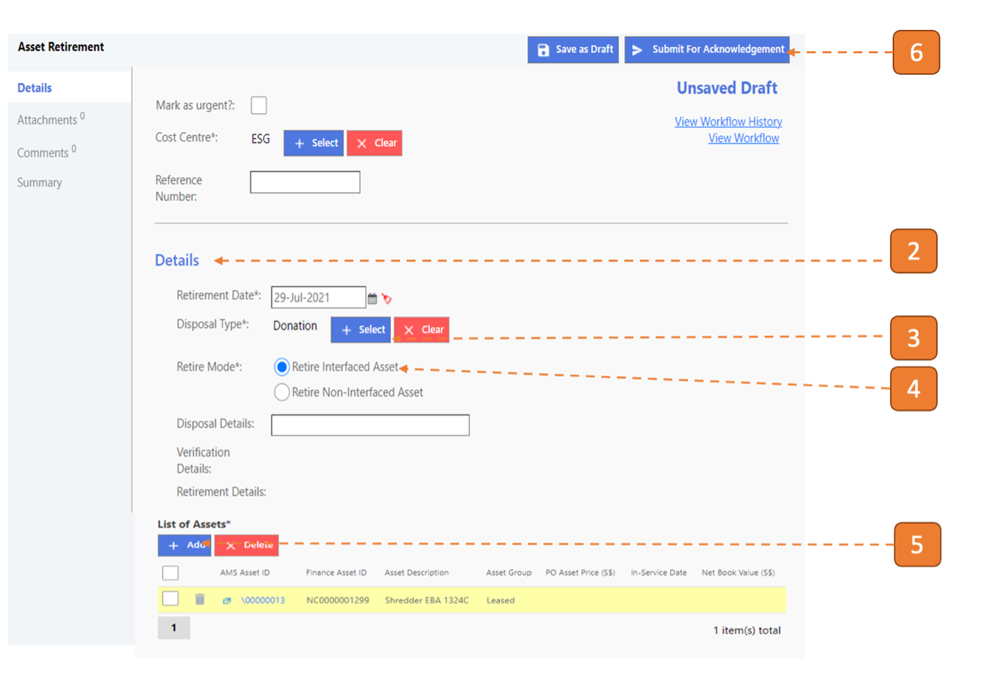
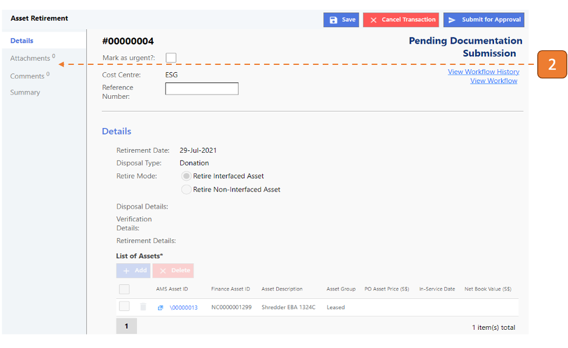
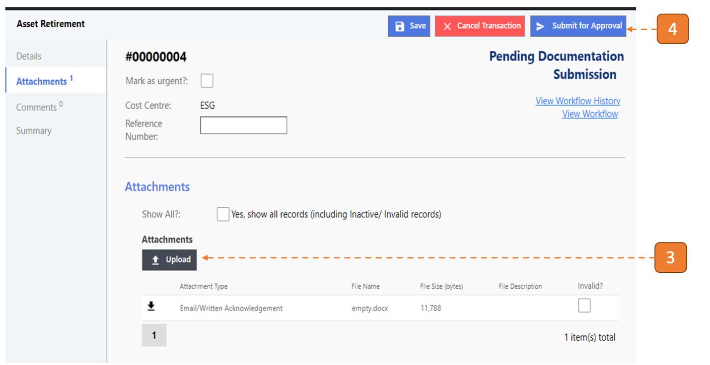

# For Custodian/Asset Manager

## How do I retire a Non-Interfaced Asset?

> Navigate to: **Asset > Asset Retirement**.

1. Select **New**.

2. Fill in information under the Details section.

3. Select **“Retire Non-Interfaced Asset”** for Retire Mode.

4. Click on **Add** to populate the assets for this transaction.

5. Click on **Submit for Acknowledgement**.

## How do I retire an Interfaced Asset (Disposal Type = Damaged)?

> Similarly, navigate to: **Asset > Asset Retirement**.

1. Select **New**.

2. Fill in information under the Details section.

3. Select **“Damaged”** for Disposal Mode.

4. Select **“Retire Interfaced Asset”** for Retire Mode.

5. Click on **Add** to populate the assets for this transaction.

6. Click on **Submit for Acknowledgement**.

## How do I retire an Interfaced Asset (Disposal Type = Donation)?

> Similarly, navigate to: **Asset > Asset Retirement**.

1. Select **New**.

2. Fill in information under the Details section.

3. Select **"Donation"** for Disposal Mode.

4. Select **“Retire Interfaced Asset”** for Retire Mode.

5. Click on **Add** to populate the assets for this transaction.

6. Click on **Submit for Acknowledgement**.

## How do I submit Documentation for the Retirement transaction?

1. Click the task in the inbox.

2. Navigate to the **Attachments** tab on the left panel.

3. Click on the **Upload** button to upload supporting documents.

4.	Click on **Submit for Approval**.

