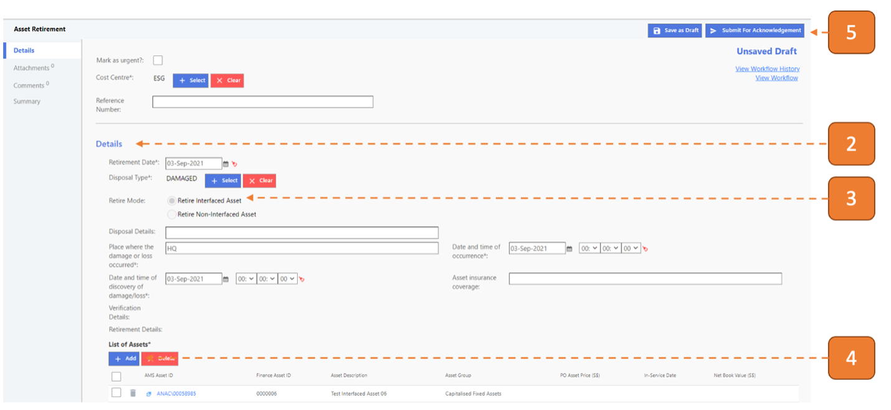

# For Managing Agent (MA)

## How do I Retire an Asset?

> Navigate to: **Asset > Asset Retirement**.

1. Select **New**.

2.	Fill in information under the Details section.

3.	Select **"Retire Interfaced Asset"** for Retire Mode.

4.	Click on **Add** to populate the assets for this transaction.

5.	Click on **Submit for Acknowledgement**.

