# For Asset Managers 

## How do I Register a Non-interfaced Asset?

> Navigate to: **Asset > Asset Registration > Register Asset**

1. Select **New**.

2. Select **Register Non-Interfaced Asset**.

3. Select **Add**.

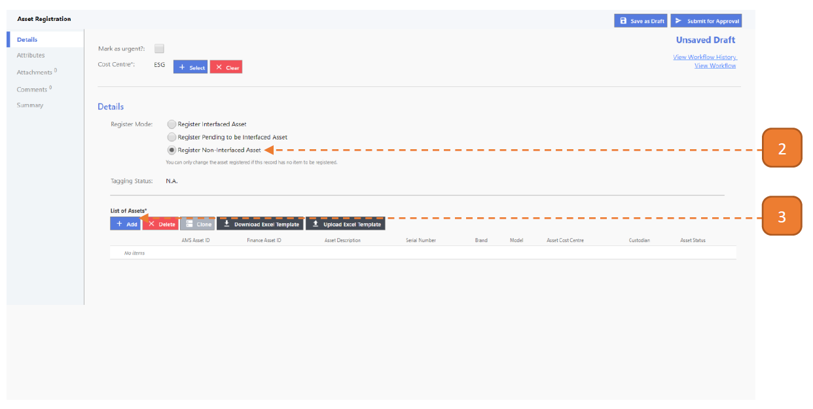

4. Enter the **Asset Description**.

5. Select the **Asset Category**.

6. Select the **Asset Group**. 

7. Select the **Custodian**.

8. Select **Update**.

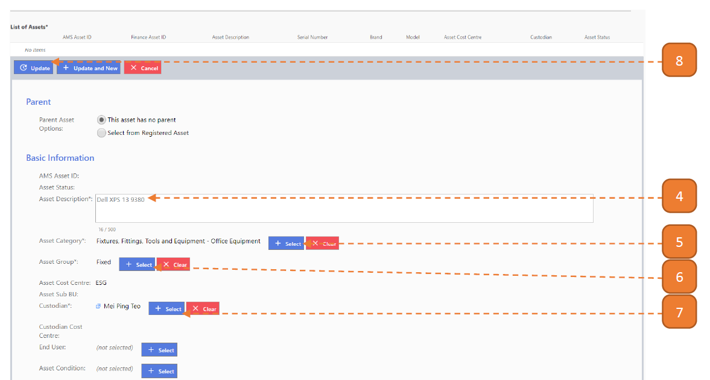

9. Select **Submit for Approval**.

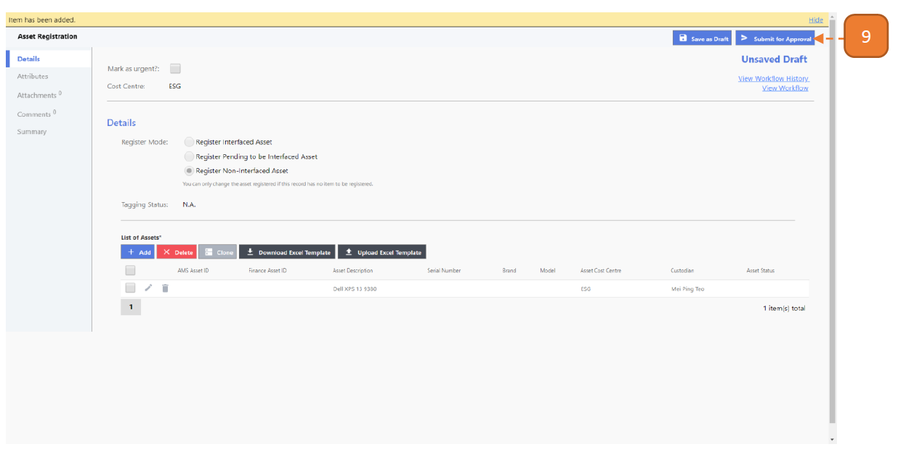

10. Select **Confirm**.

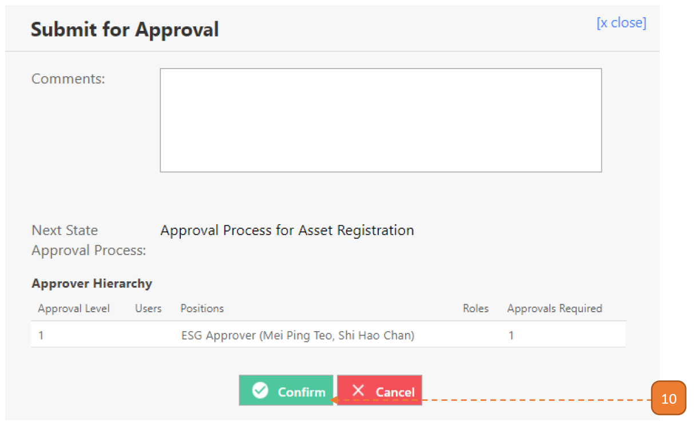

## How do I Register an Interfaced Asset?

> Navigate to: **Asset > Asset Registration > Register Asset**

1. You will find a draft record in the **search page**. 
Select on the record **Draft**.

These drafts are automatically created by the system in batches from your finance system (sorted by cost centre).

2. Verify that this transaction is for interfaced assets by ensuring that **“Register Interfaced Asset”** is selected.

3. Verify that the assets should be in this batch of assets to be registered.

4. Select **Submit for Approval**.

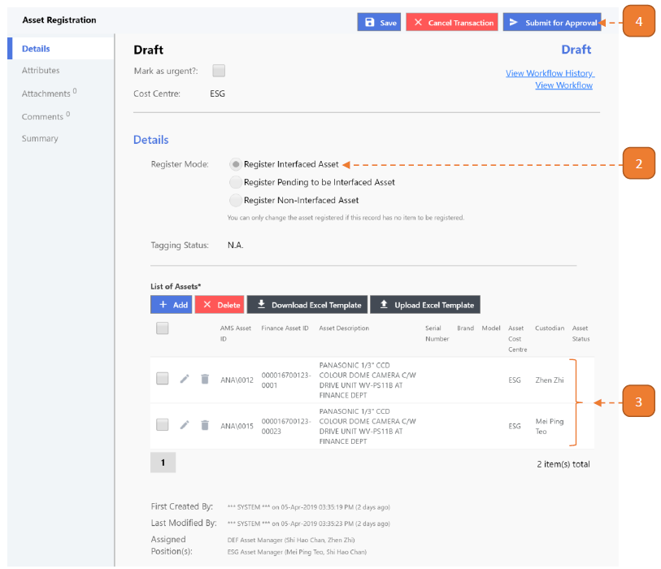

5. Select **Confirm**.

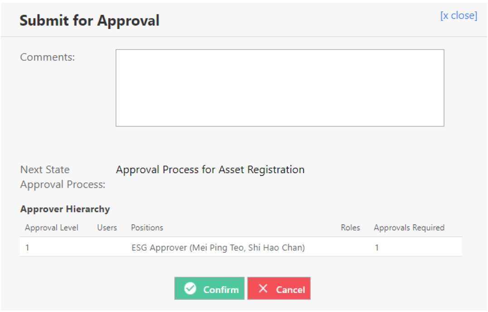

## How do I Register a Non-Interfaced Asset using Excel Upload?

> Similarly, navigate to: **Asset > Asset Registration > Register Asset**

1. Select **New**.

2. Select **“Register Non-Interfaced Asset”**.

3. Select the **Download Excel Template button**.

4. Open the downloaded excel file (Selection to opening the file may depend on browser).

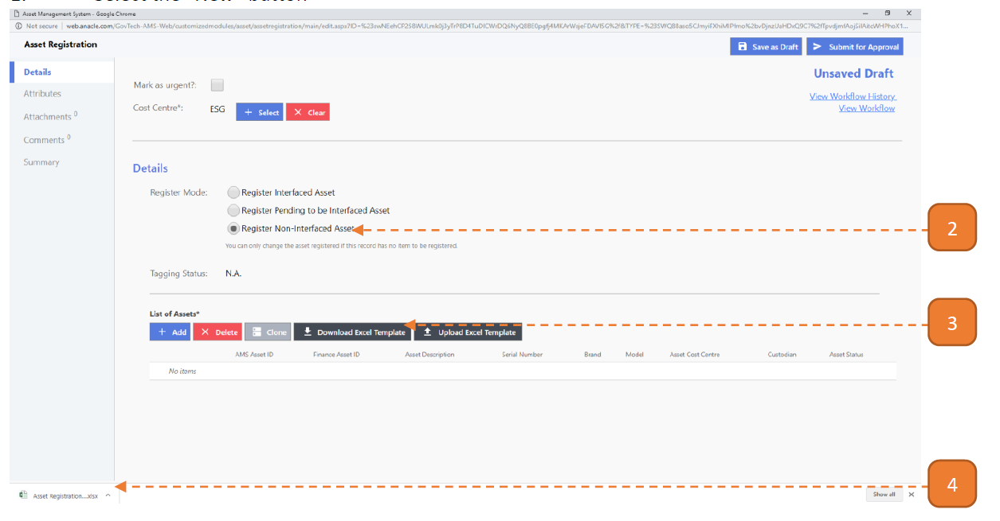

5. In the Upload Asset worksheet enter the **“Asset Description”**, **“Asset Category”**, **“Asset Group”** and **“Custodian”**. 
You may refer to the Master Data worksheet below.

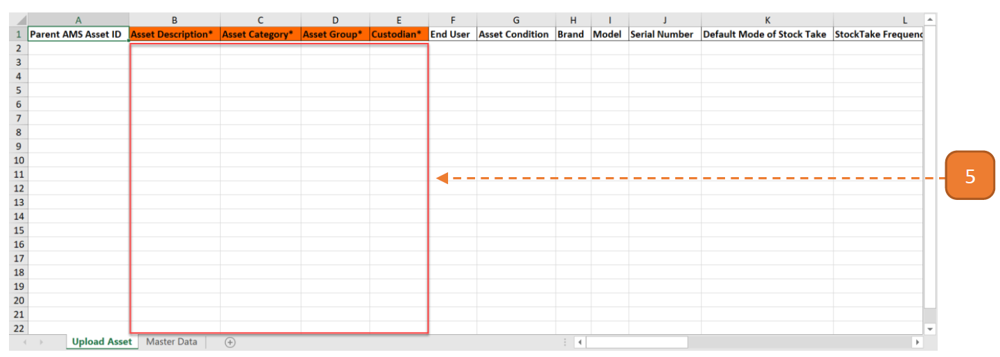

How to refer to Master Data Example: 

- For a new entry you wish to enter the **“Asset Group”**. 
- On referring to the Master Data, you understand that you may only enter **“Fixed”** or **“Leased”**.

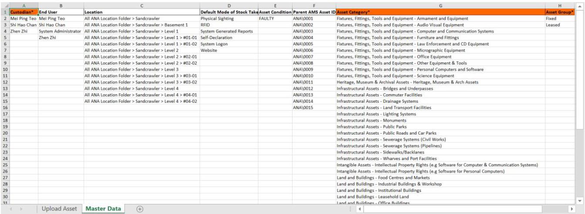

6. Enter the mandatory fields denoted by the **orange column header**.

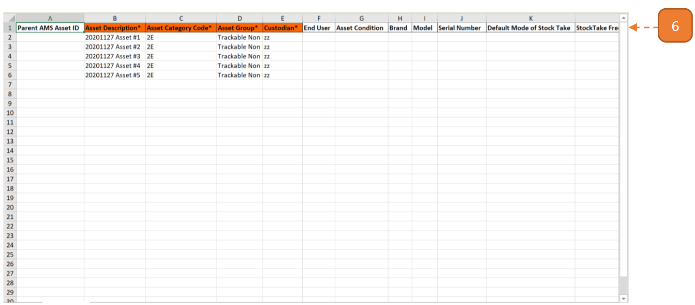

7. To upload photos, search for the **“Relative Zip Folder Path”** column. 
Indicate the **image name, including the extension**. 
Proceed to save the Excel workbook.

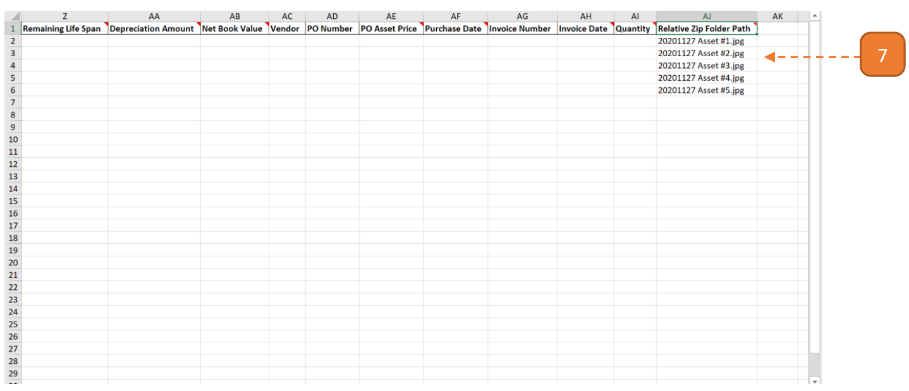

8. Prepare the images in a folder. 
Select all images for this registration.

9. Zip the images.

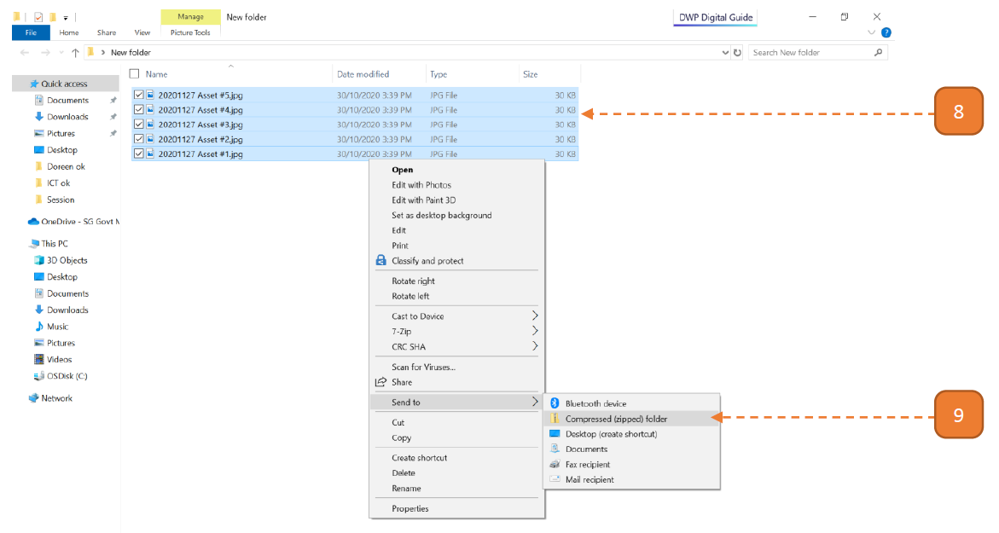

10. Return to the webpage and select **Upload Excel Template**.

11. Browse for the Excel Workbook & Zip File.

12. Select **Upload Template**.

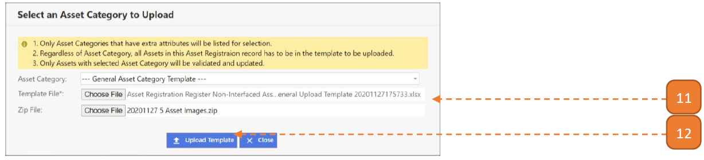

Once the upload is confirmed, the system will check the excel records for errors. 
When this validation is complete a summary will be shown as follows.

13. If **no critical errors/warnings are found**, select **Confirm to Proceed**. 

14. Otherwise, if any **critical errors are found**, select the **Download Validated Excel**. 

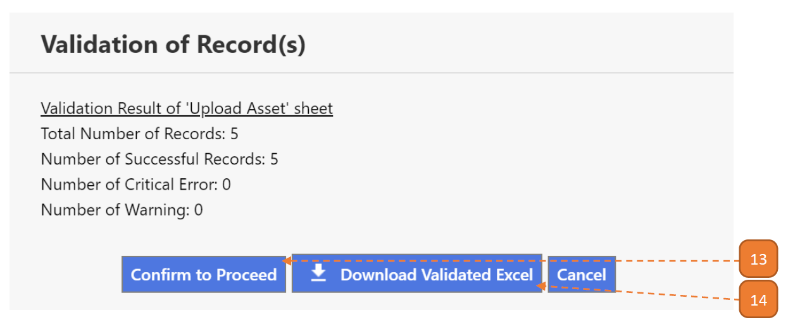

The first 2 columns on the validated worksheet will describe the critical errors/warnings that is present in the line item such as “[Asset Description] cannot be found.”

15. Select **Close**.

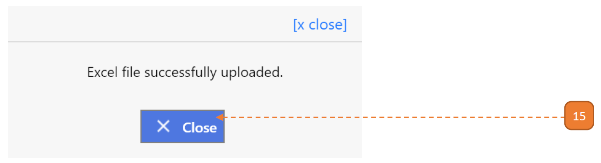

16. The assets will be populated in the transaction.

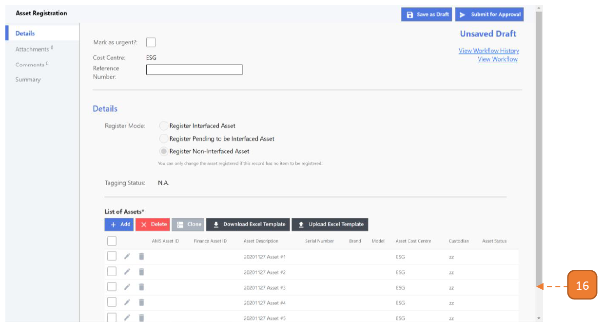

17. Select **Confirm**.

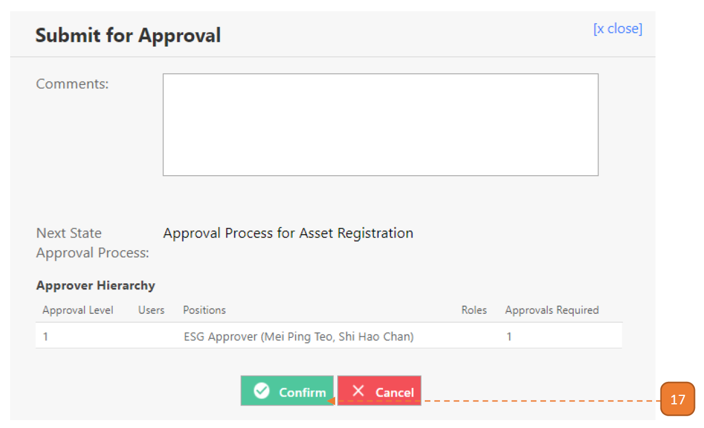