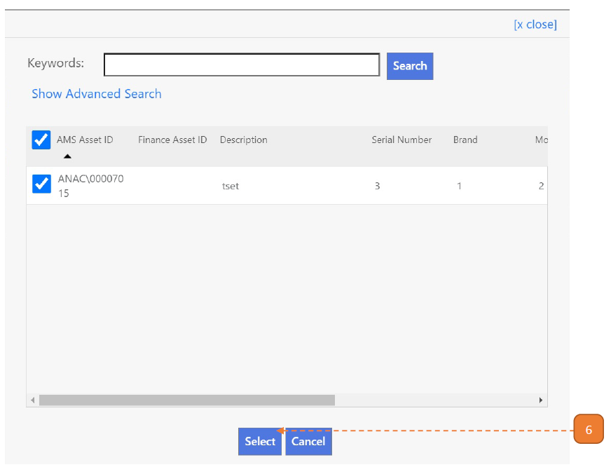

# For Asset Tag Printer

## How do I Print an Asset?

> Navigate to: **Asset > Asset Registration > Asset Printing**

In this page, there are 2 tables.

1. **Asset Registration** – Printing: Assets in this table are to be registered assets.

2. **Asset Retagging** – Printing: Assets in this table was sent from retagging.

3. Select **Print RFID Tab**.

4. Under **RFID Template** field, select the appropriate printing template. 

5. Select **Add**.

6. Search for the assets for printing. Select the search result(s) and select the **Select** button.

7. Select **Print Tags**. The tags will be printed. Close this window.

8. Under the **Is Printed?** column, assets that were submitted for printing will be checked.

9. Select **Submit Results**.

10. Select **Confirm**.

11. The asset record that was submitted for printing will be cleared. 
A banner will show that the record has been saved to the system.

Note: Assets that are submitted on this page will be required to update tagging details - web tagging, mobile tagging.