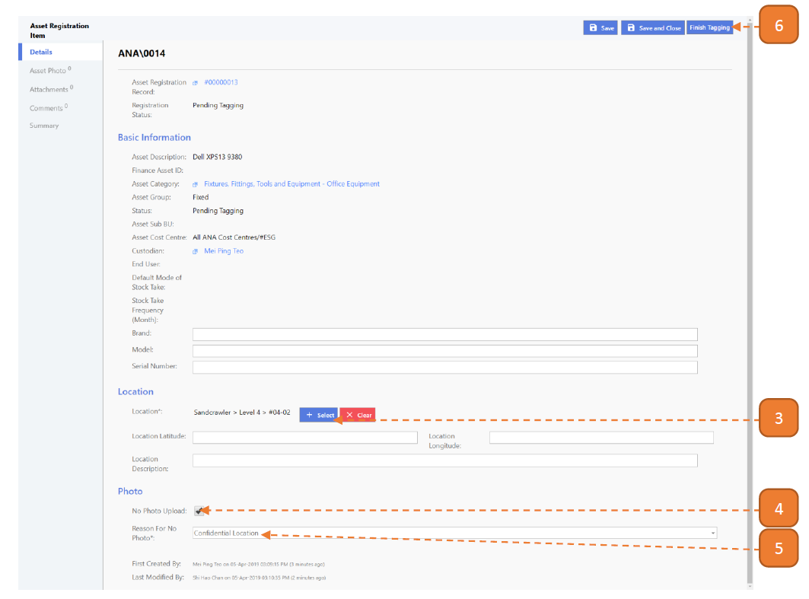

# For Taggers

## How do I Tag an Asset? (Web Version)

> Navigate to **Home**. View your inbox, these are all your **pending tasks**.

1. Select the transaction for tagging by selecting the link in **blue**. 
In this case, it’s **“Go To Page”**.

2. In this page you will find the outstanding items for tagging. 
Select the **“Asset ID”** link.

3. Select **Location**.

If there are **no photos** to upload, follow steps: **4, 5, 6, 13**. 

Otherwise, If there are photos to upload, follow steps: **7, 8, 9, 10, 11, 12, 13**.

4. Check **No Photo Upload**.

5. Enter **Reason For No Photo**.

6. Select **Finish Tagging**.

7. Select the **Asset Photo** tab.

8. Select **Upload**.

9. Select the **Choose File** button and browse for an image to tag.

10. Select **Upload**.

11. Select **Finish Tagging**.

12. Select **Confirm**.

13. Note that after tagging is complete, the record will no longer be on the page.

