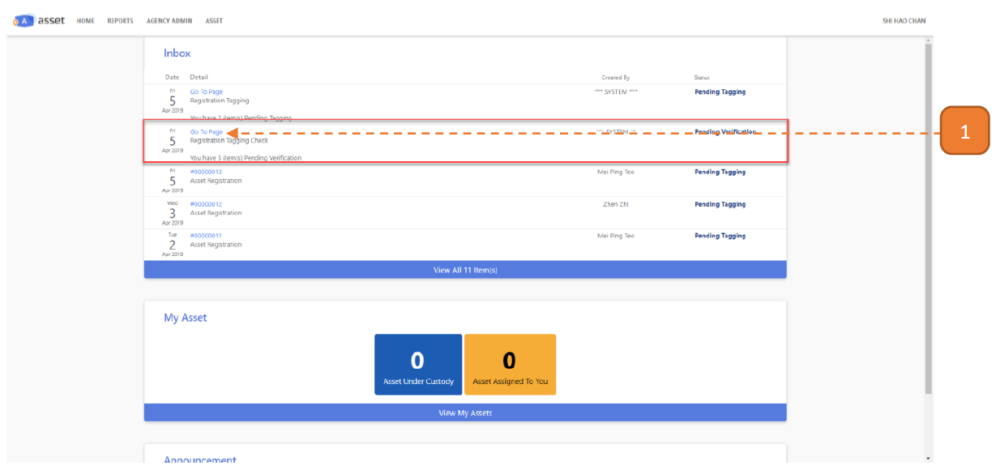
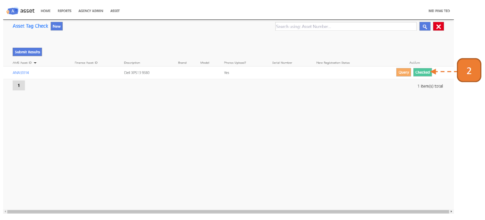
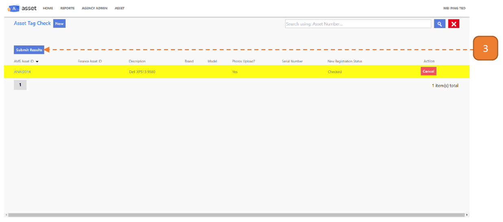
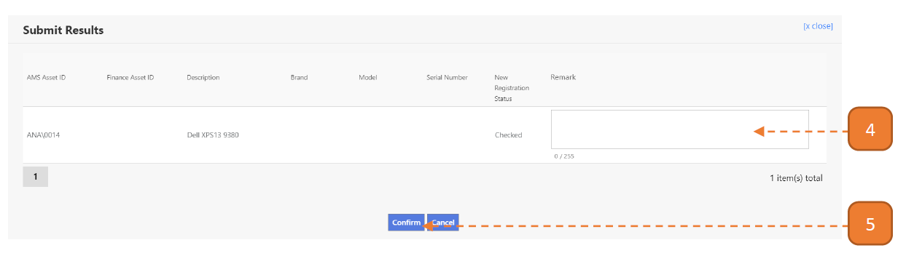
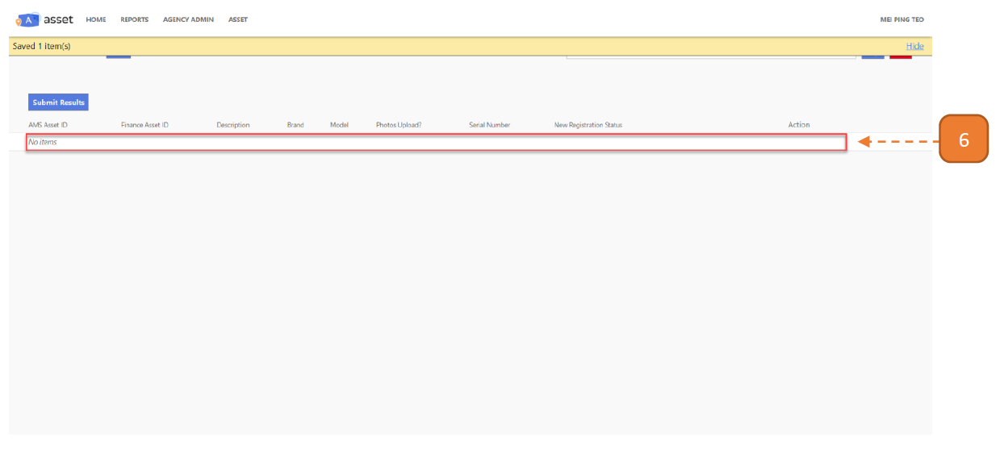

# For Tagging Verifiers

## How do I Verify a Tagged Asset?

> Navigate to **Home**. View your inbox, these are all your **pending tasks**.

1. Select the transaction for tagging verification by selecting the link in **blue**.

- In this case, it’s “Go To Page”.

2. In this page, you will find the **outstanding items for tagging check**. 
Select **Checked**.

3. The record will be highlighted once the selection has been made. 
Select **Submit Results**.

4. Enter the “Remarks” if applicable.

5. Select **Confirm**.

6. Note: After tagging check is complete, the record will no longer be on the page.

