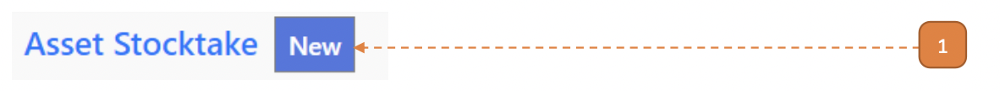
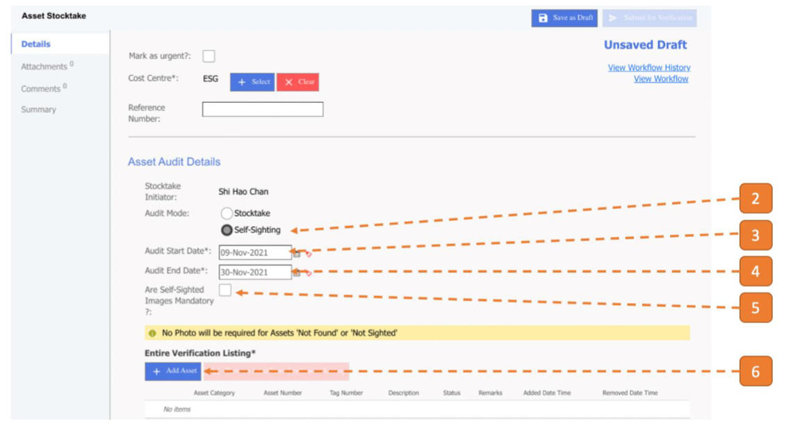
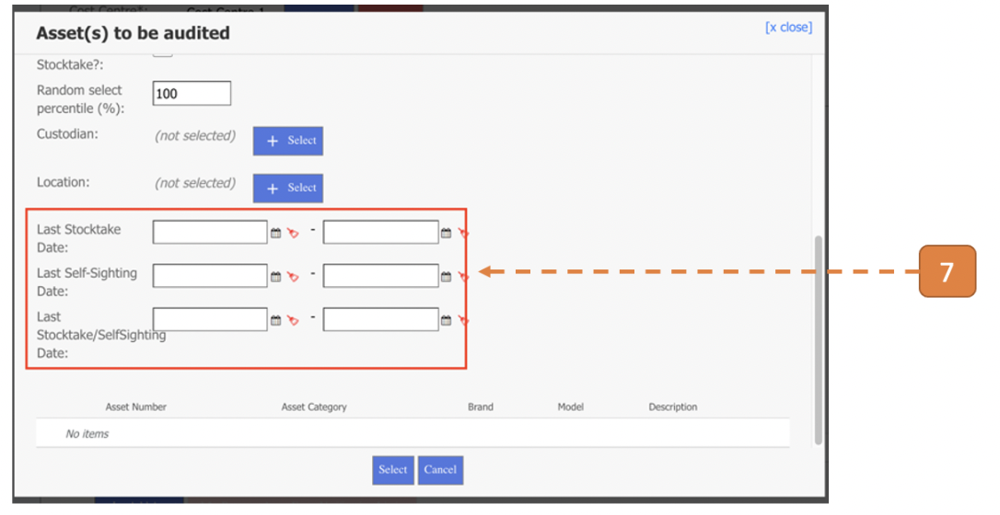
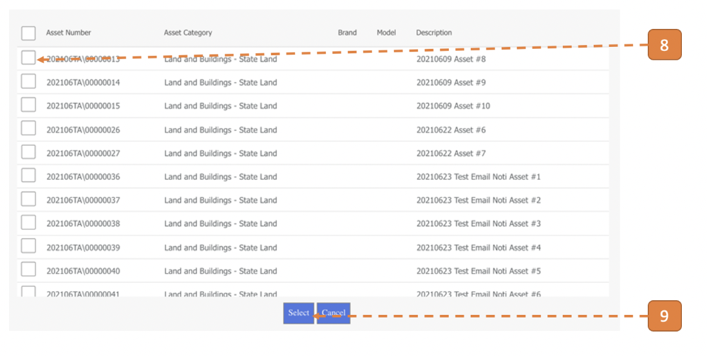
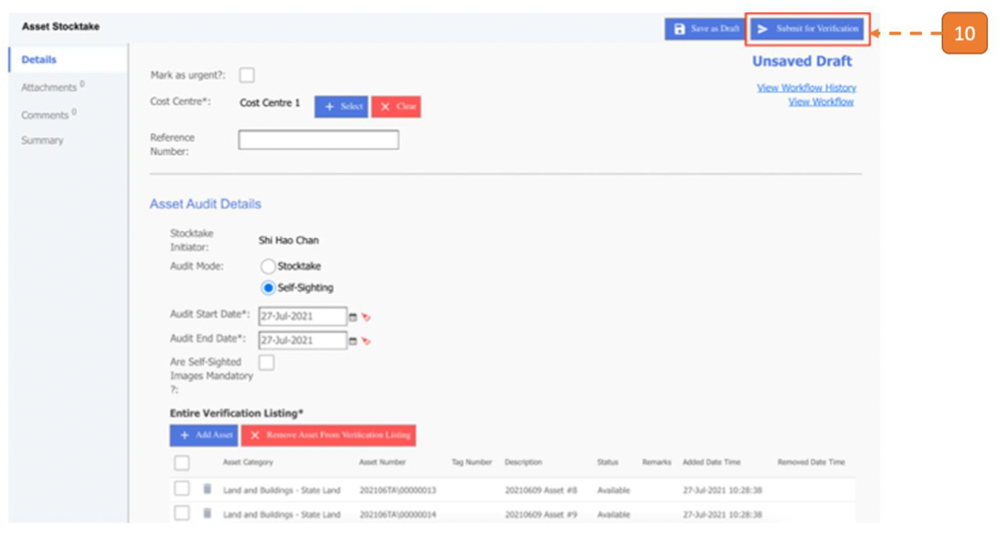
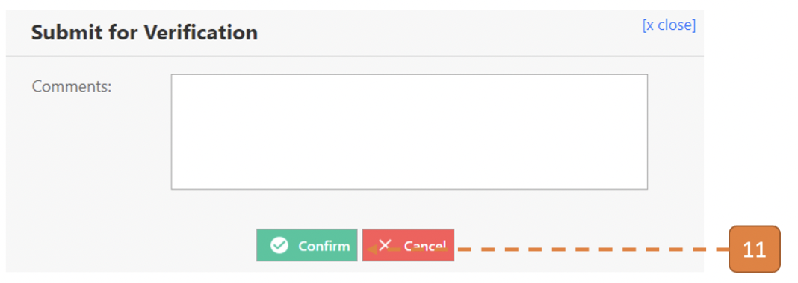
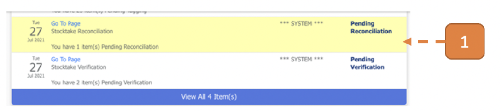
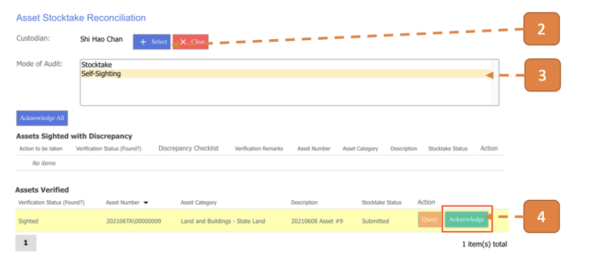
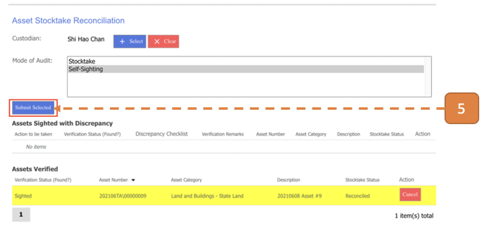
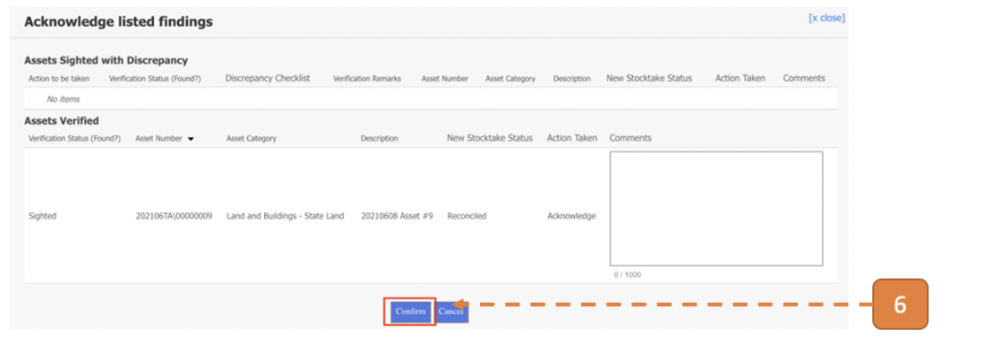

# For Asset Manager (Audit Mode = Self-Sighting)

## How do I Create a Self-Sighting Stocktake?

> Navigate to **Asset > Asset Stocktake > Asset Stocktake**.

1. Select **New**.

2. Select Audit Mode as **“Self-sighting”**.

3. Input **Audit Start Date**.

4. Input **Audit End Date**.

5. Select the **“Are self-sighted images mandatory?”** checkbox if you want to make self-sighting images upload mandatory at the point of physical verification.

6. Select the **Add Asset** button.

7. Option to filter asset selection by indicating last self-sighting/stocktake date if required, else select the **Search** button.

8. Check the relevant asset records for self-sighting in the list of results.

9. Select the **Select** button.

10. Select **Submit for Approval**.

11. Select **Confirm**.

## How do I Perform Reconciliation of the Self-sighting Assets on Behalf of the Custodians?

> Navigate to **Home**. View your inbox, these are all your **pending tasks**.

1. Select the task that states **Pending Reconciliation**.

2. Select the Custodian that you are acknowledging on behalf of.

3. Select **“Self-sighting”** as the Mode of Audit.

4. Click on the **Acknowledge** button.

5. Select **Submit Selected**.

6. Click **Confirm**.

