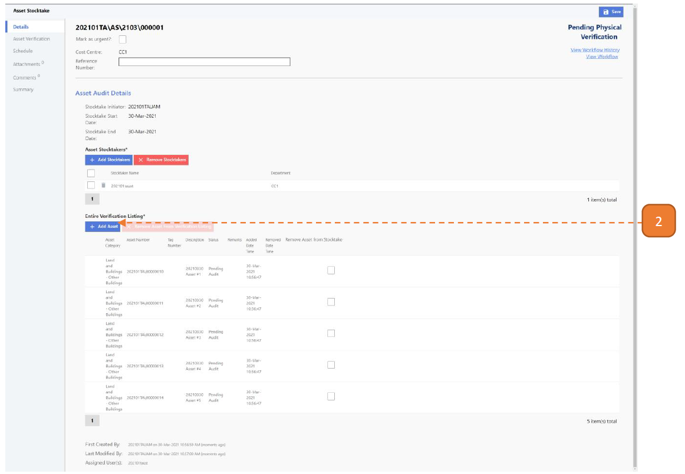
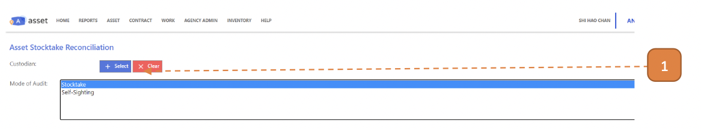

# For Asset Managers (Audit Mode = Stocktake)

## How do I Create a Stocktake?

> Navigate to: **Asset > Asset Stocktake > Asset Stocktake**

1. Select **New**.

2. Select Audit Mode as **"Stocktake"**.

3. Input **Audit Start Date**.

4. Input **Audit End Date**.

5. Select the **Add Stocktakers** button, you can add more than 1 stocktaker.

6. Select the **Add Asset** button.

7. Enter the search fields as required.

8. Select **Search**.

9. If stocktake is a partial selection of the search results, enter the **Random select percentile**.
- Eg: Full list of assets = 100 results, search for assets from ABC cost centre = 50 results, search for assets from ABC cost centre AND 50% “Random select percentile” = 25 results.

10. Check the relevant asset records for stocktaking in the list of results.

11. Select the **Select** button.

12. Select **Submit for Verification**.

13. Select **Confirm**.

## How do I Add an Asset During Stocktake?

> Navigate to: **Asset > Asset Stocktake > Asset Stocktake**.

1. Select the relevant transaction.

2. Select **Add**.

3. Search for the relevant Asset.

4. Check the record.

5. Select the **Select** button.

6. The new record will be appended.

7. Select **Save**.

## How do I Remove an Asset During Stocktake?

> Similarly, navigate to: **Asset > Asset Stocktake > Asset Stocktake**.

1. Select the relevant transaction.

2. Under the **“Remove Asset from Stocktake”** column, select the checkbox.

3. Select **Save**.

## How do I Acknowledge the Stocktake Findings on Behalf of the Custodians?

> Navigate to: **ASSET > Asset Stocktake > Stocktake Reconciliation**.

1. Select the **Select** button.

2. Search for the Custodian.

3. Select the Custodian.

4. Select Mode of Audit as **"Stocktake"**.

5. Select on **Query** or **Acknowledge** button found on each row.

