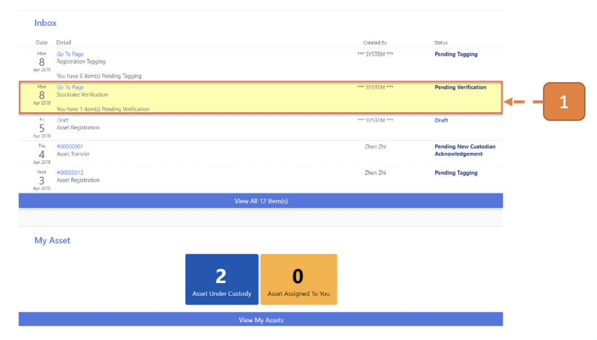
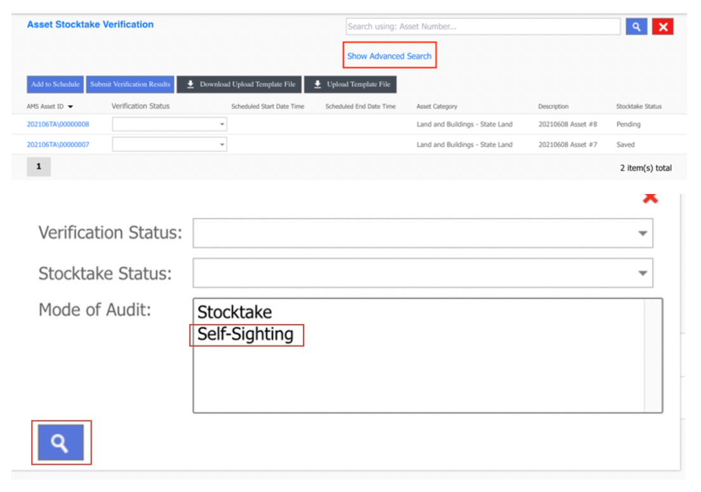
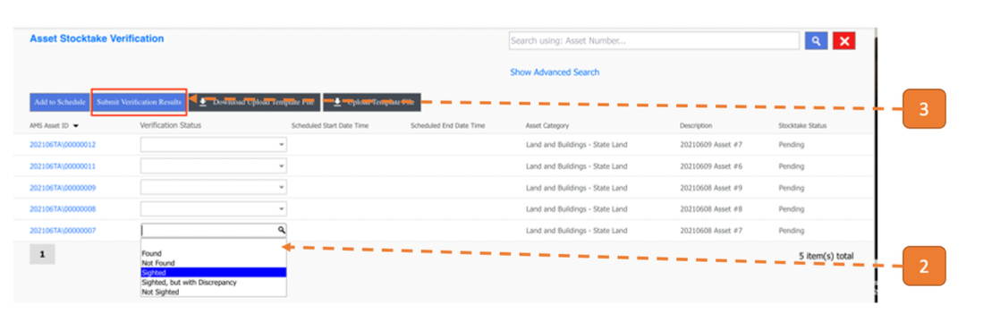
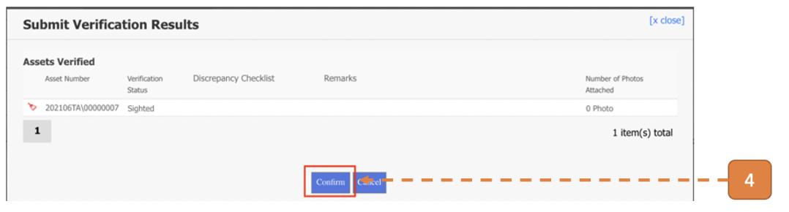
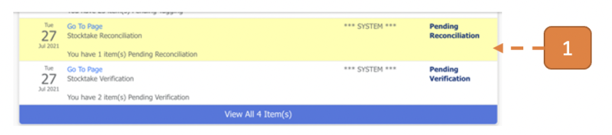
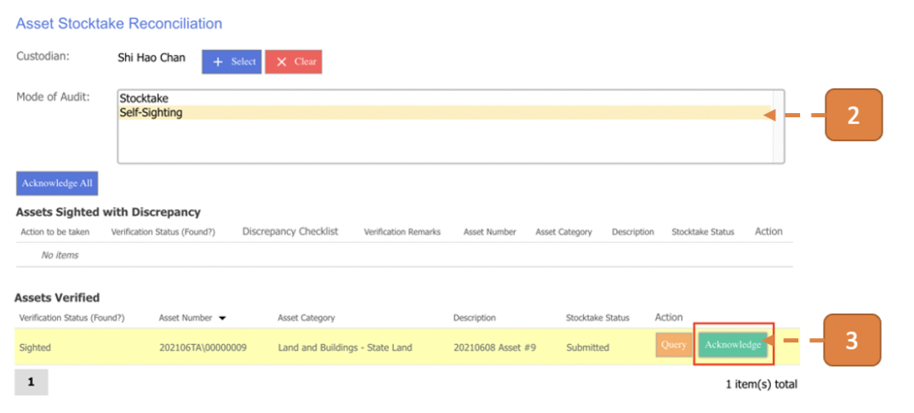
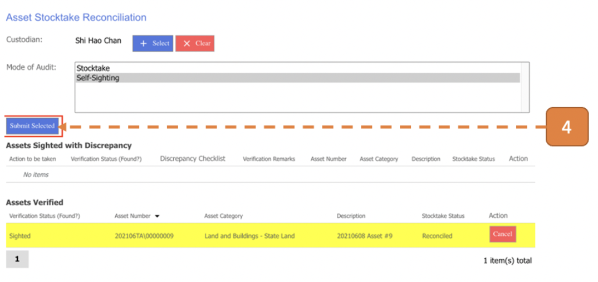
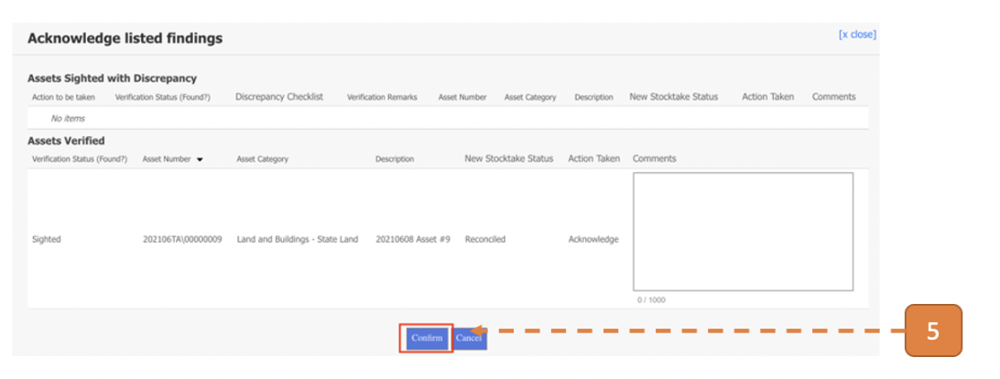

# For Custodian & End User (Audit Mode = Self-Sighting)

## How do I Perform Physical Verification of Self-sighting Assets?

> Navigate to **Home**. View your inbox, these are all your **pending tasks**.

1. Select the task that states **Pending Verification**.

Alternatively, navigate to **Asset > Asset Stocktake > Stocktake Verification** and click on **Show Advanced Search**.

Select Mode of Audit = **“Self-Sighting”** and click on the **magnifying icon** to filter the list of asset stocktake verification transactions to display only **Self-sighting Asset Transactions**.

2. Select a value under **Verification Status**.

3. Click on the **Submit Verification Results** button.

4. Click **Confirm**.

## How do I Perform Reconciliation of Self-sighting Assets? (For Custodian)

> Navigate to **Home**. View your inbox, these are all your **pending tasks**.

1. Select the task that states **Pending Reconciliation**.

2. Select **“Self-sighting”** as the Mode of Audit.

3. Click on the **Acknowledge** button.

4. Select **Submit Selected**.

5. Click **Confirm**.

