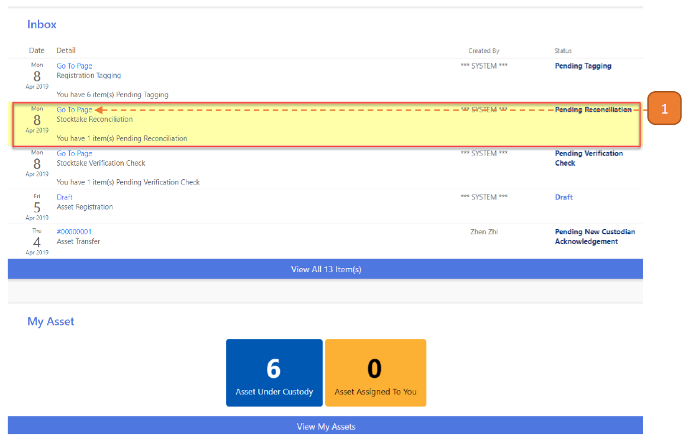
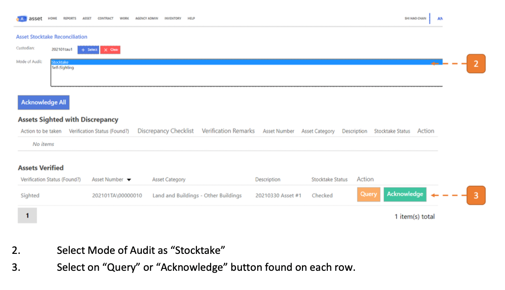
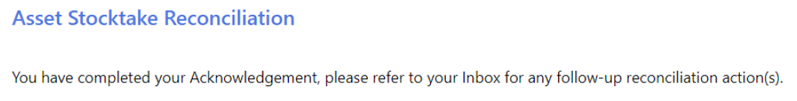

# For Custodians

## How do I Acknowledge the Stocktake findings?

> Navigate to **Home**. View your inbox, these are all your **pending tasks**.

1. Select the transaction for stocktake reconciliation by selecting the link in **blue**.

- In this case, it’s “Go To Page”.

In this page, you will find the stocktake assets under your custody and the actions to be taken.

2. Select on **Query** or **Acknowledge** found on each row. 
To acknowledge all records, skip this step.

3. Select **Acknowledge all** and confirm.

You will be redirected to the page shown.

