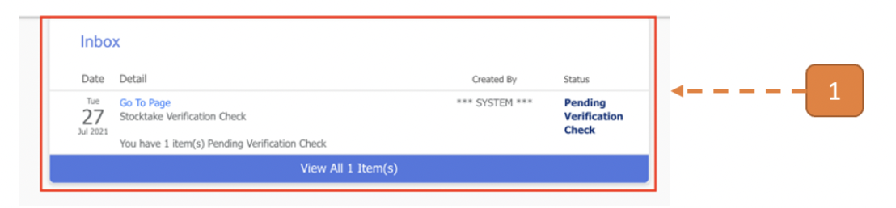
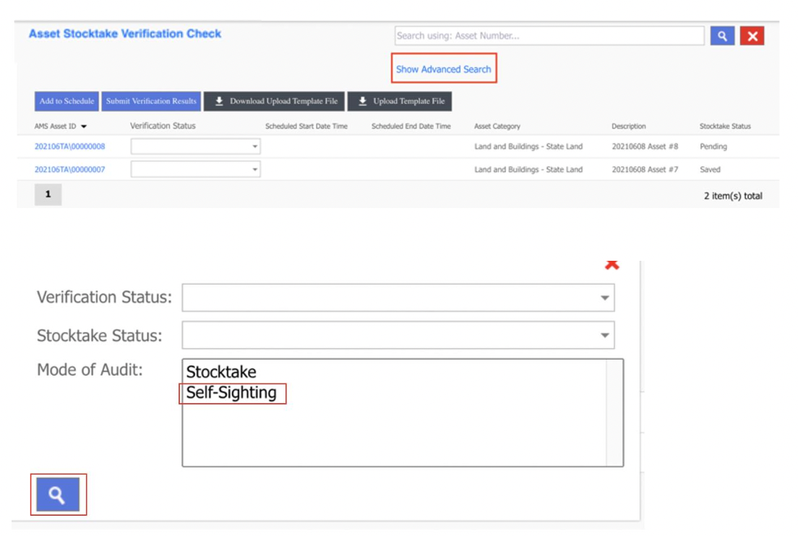
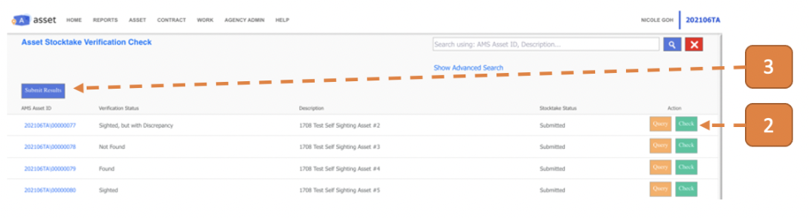
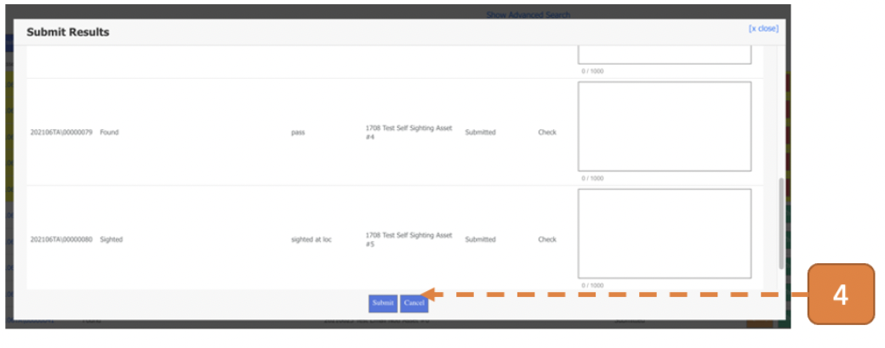

# For Self-sighting Verifier (Audit Mode = Self-Sighting)

## How do I Verify the Physical Verification results of Self-sighting Assets?

> Navigate to **Home**. View your inbox, these are all your **pending tasks**.

1. Select the task that states **Pending Verification Check**.

Alternatively, navigate to **Asset > Asset Stocktake > Stocktake Verification** and click on **Show Advanced Search**.

Select Mode of Audit = **“Self-Sighting”** and click on the **magnifying icon** to filter the list of asset stocktake verification transactions to display only **Self-sighting Asset Transactions**.

2. Click on the **Check** button.

3. Select **Submit Results**.

4. Select **Submit**.

