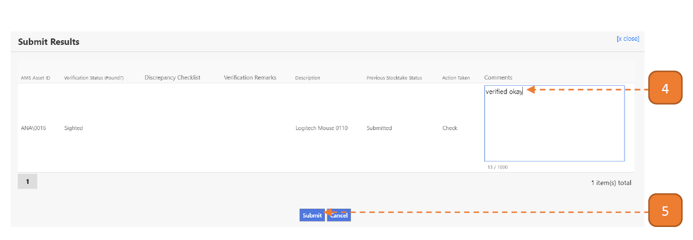

# For Stocktake Verifiers

## How do I Verify the Stocktake findings?

> Navigate to **Home**. View your inbox, these are all your **pending tasks**.

1. Select the transaction for stocktake verification by selecting the link in **blue**.

- In this case, it’s “Go To Page”.

2. In this page, you will find the outstanding items for asset stocktake verification check. 
Select **Checked**.

Note: The record will be highlighted once the selection has been made.

3. Select **Submit Results**.

4. Enter the **Comments** if applicable.

5. Select **Submit**.

Note: After tagging check is complete, the record will no longer be on the page.

