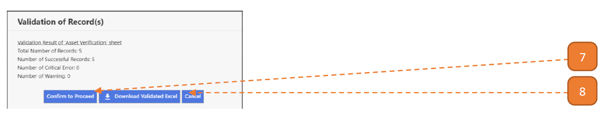

# For Stocktakers

## How do I Perform Stocktake? (Web Version)

> Navigate to **Home**. View your inbox, these are all your **pending tasks**.

1. Select the transaction for stocktake verification by selecting the link in **blue**.

- In this case, it’s “Go To Page”.

2. Select the **Verification Status** dropdown.
Skip steps **3, 4, 5, 6, 7** if no addition remarks and verification of more asset information is required.

    If **“Sighted with Discrepancies”** is selected, please note that the system will create the following reconciliation transactions (after stocktake is complete):

- Wrong location?: Asset Update

- Wrong serial number?: Asset Update

- Wrong brand?: Asset Update

- Wrong model?: Asset Update

- Wrong custodian?: Asset Transfer

- Missing/Defaced Tag?: Asset Retagging

- Defective?: Asset Maintenance

3. Select the asset record link.

4. Verify the asset details.

5. Select the **Verification Status** dropdown.

6. Enter the **Verification Remarks** if applicable.

7. Select **Save and Close**.

8. Select **Submit Verification Results**.

9. Verify the submission through this summary page and select **Confirm**.

10. Note that after asset stocktake verification is complete, the record will no longer be on the page.

## How do I Perform Stocktake Using Excel Upload? (Web Version)

1. Follow Step 1 in [Perform Stocktake](#) earlier.

2. Select **Download Upload Template File**. 
An excel workbook will be downloaded.
If the button is unavailable, notify your agency admin.

3. Open the Excel workbook. 
A list of assets from the stocktake verification page will be downloaded. 
Note: The hint can be found in the cell comments.

“Verification Status” column **accepted values**:

1: Indicate asset with verification status as **“Found”**

2: Indicate asset with verification status as **“Not Found”**

3: Indicate asset with verification status as **“Sighted”**

4: Indicate asset with verification status as **“Sighted, but with Discrepancy”**

5: Indicate asset with verification status as **“Not Sighted”**

“Wrong Location”, “Wrong Serial Number”, “Wrong Brand”, “Wrong Model”, “Wrong Custodian”, “Missing/Defaced Tag”, “Defective” column **accepted values**:

- Yes: Mark with discrepancy

- No: Don’t mark with discrepancy

**Note: leave cell blank for all cases other than assets “Sighted, but with Discrepancy”**

4. Indicate the respective asset’s stocktake verification results, below for example.

5. Save the excel workbook. Return to webpage and select **Upload Template File**.

6. Browse and select **Upload**.

Once the upload is confirmed, the system will check the Excel records for errors. 
When this validation is complete, a summary is shown.

7. If no critical errors/warnings are found, select the **Confirm to Proceed**.

8. If critical errors/warnings are found, select **Download Validated Excel**.

    The first 2 columns on the validated worksheet will describe the critical errors/warnings that is present in the line item such as “[AMS Asset ID] cannot be found.”

- The stocktake assets will be updated with the workbook’s information.

9. The stocktake assets will be updated with the workbook’s information.

