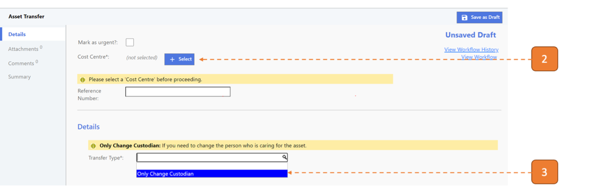
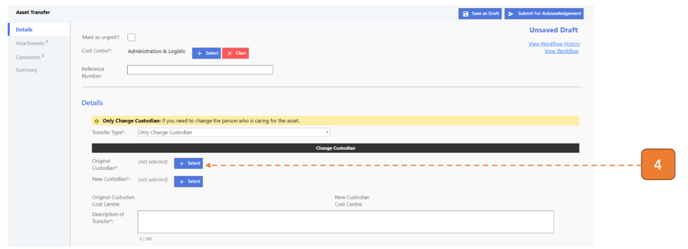
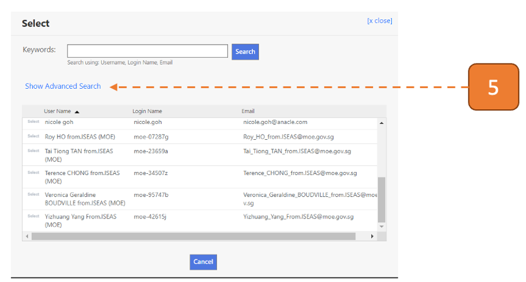
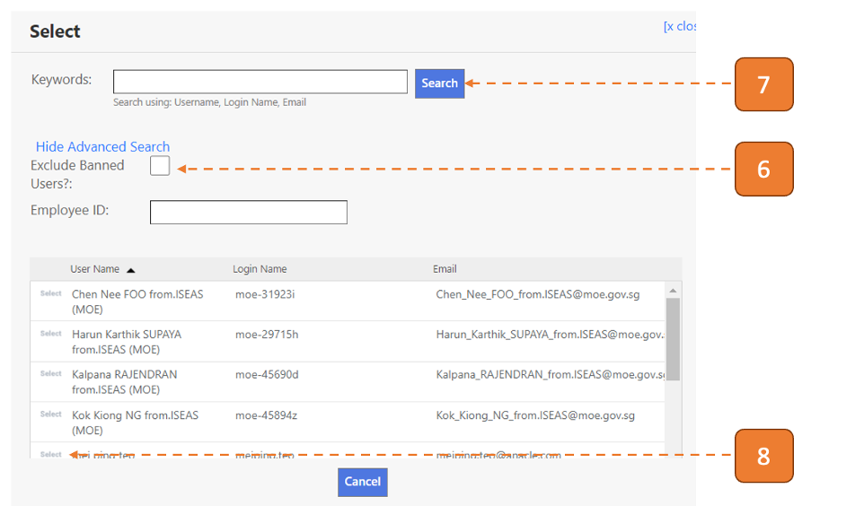
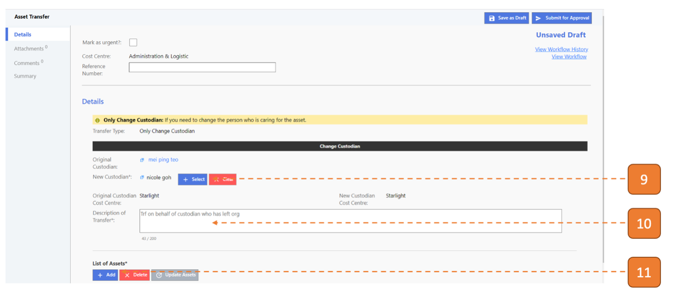
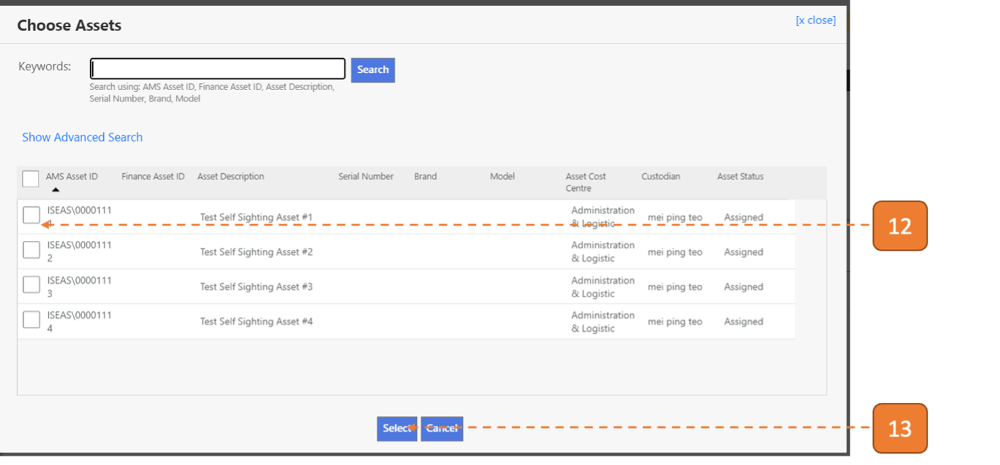
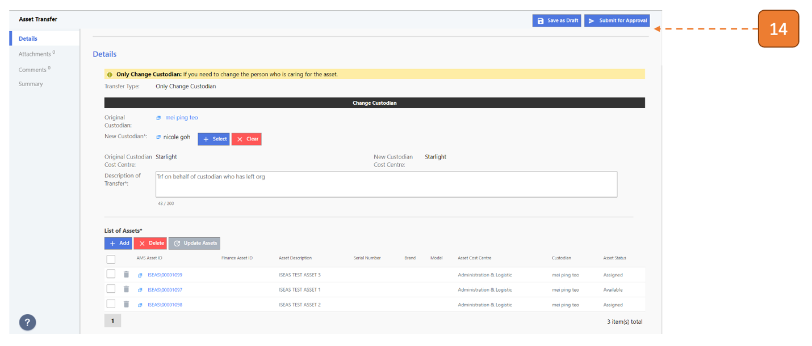

# For Asset Managers (For transfer of inactive custodian's asset only)

Note: If custodian is still active, workflow will be routed to custodian for acknowledgement

## How do I initiate on behalf of the Custodian?

> Navigate to **Asset > Asset Transfer**

1. Select **New**.

2.	Click on the **Select** to choose a Cost Centre.

3.	Select the **Transfer Type** as “Only Change Custodian”.

4.	Click on the **Select** to choose a Custodian.

5. Click on **Show Advanced Search**.

6. Uncheck the **Exclude Banned Users?** checkbox.

7. Click on **“Search”**.

8. Select the Inactive Custodian.

9. Select a New custodian.

10. Enter description of transfer.

11. Click on **Add**.

12.	Select the checkboxes of those assets that you wish to transfer.

13.	Click on the **Select** button.

14. Click **Submit for Approval**.

