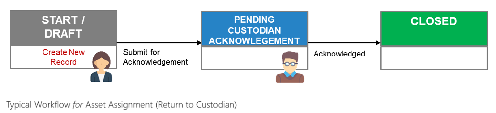

# Asset Assignment

The function of an Asset Assignment is to allow assets to be distributed for use. 
Assets may be assigned to end user, collected from end user, or reassigned from one end user to another. 
Unlike Asset Transfer, Asset Assignment does not involve any change of the asset’s custodian.

### Issuance to End user

### Return to Custodian 

### Reassigned to another End User

Click on your respective role(s) to take you through the Asset Assignment process:
- [Custodians](AAForCustodians.md)

- [End Users](AAForEndUsers.md)

- [All](AAForAll.md)