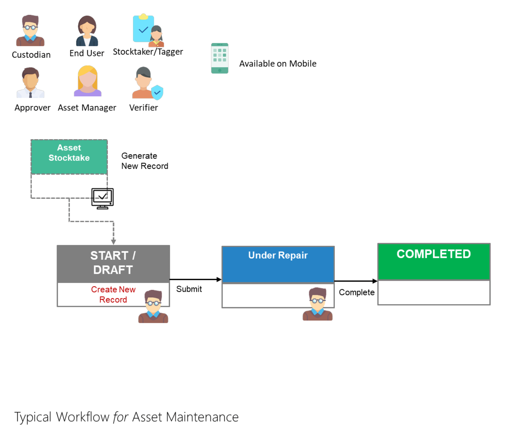

# Asset Maintenance

The function of an Asset Maintenance is to allow custodians to make note of assets undergoing maintenance.

Click on the following role to take you through the Asset Maintenance process:

- [For Custodians](AMForCustodiansStart.md)