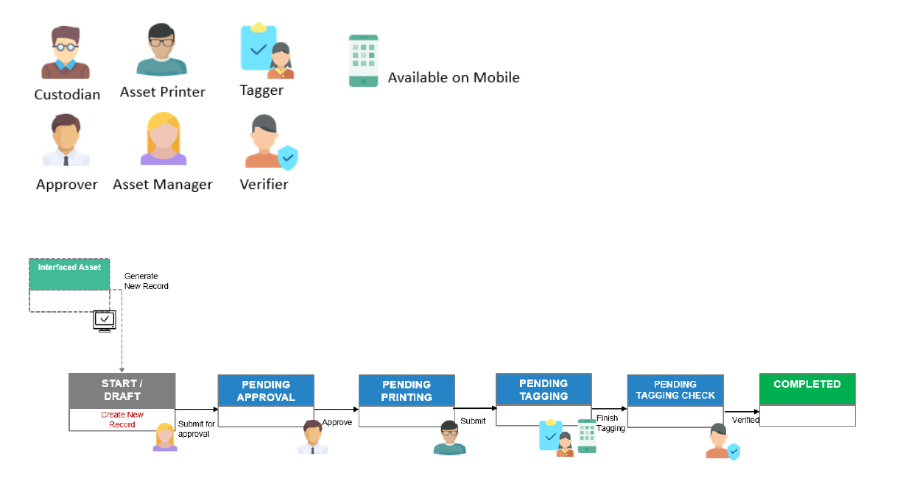

# Asset Registration

Asset Registration refers to the AMS process which one or more assets are created in AMS and available for use through tagging.

A Tagger can upload details & photos for each Asset. 

When an Asset is created in AMS via **interface**, it is in **draft state** and will need to complete an Asset Registration process before it becomes available. 

For **non-interface creation of assets**, Asset Registration must first be created with the Asset details and approved before the Assets are created by the system and assigned a system-generated unique Asset ID.

Click on your respective role(s) to take you through the asset registration process:
- [Asset Managers](ARForAssetManagersNIA)

- [Asset Approvers](ARForAssetApprovers)

- [Asset Tag Printer](ARForAssetTagPrinter)

- [Taggers](ARForTaggers)

- [Tagging Verifiers](ARForTaggingVerifiers)