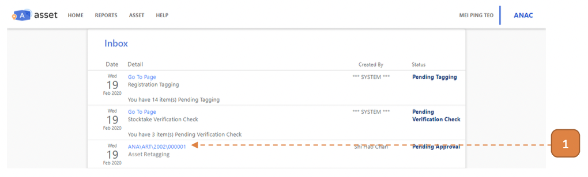
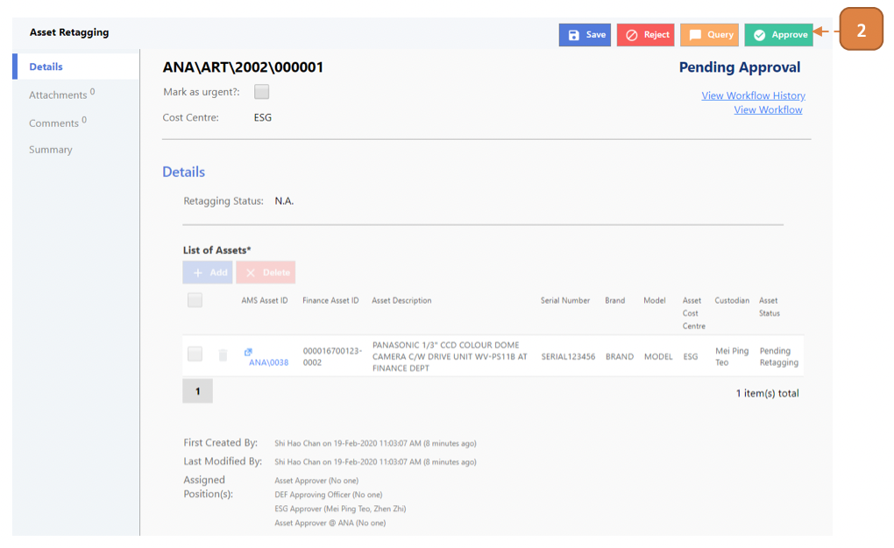
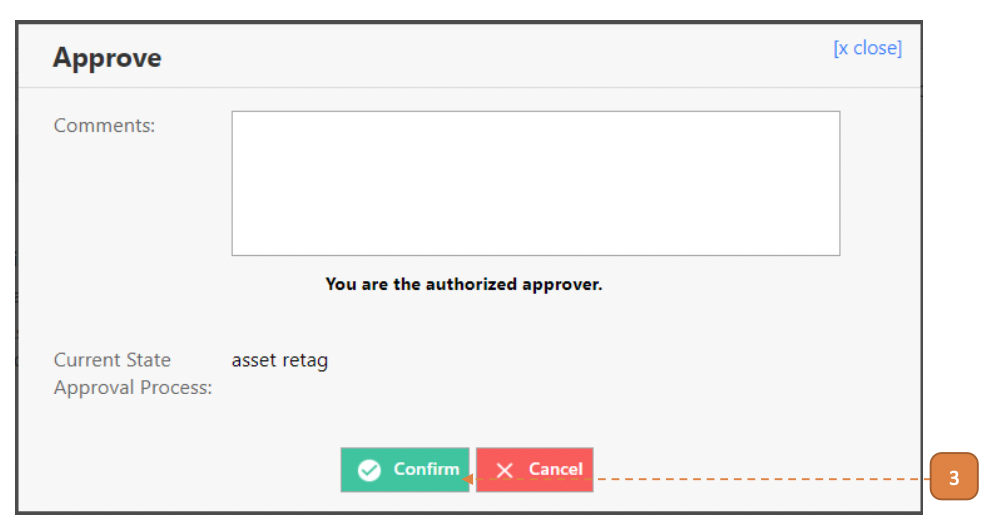

# For Asset Approvers

## How do I Approve an Asset Retagging Record?

> Navigate to **Home**. View your inbox, these are all your **pending tasks**.

1. Select the transaction for your approval by selecting the link in **blue**. 

- In this case, it’s ANA\ART\2002\000001.

2. Select the **Approve** button.

3. Select **Confirm**.

