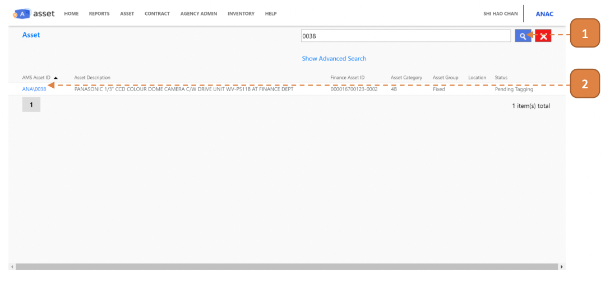
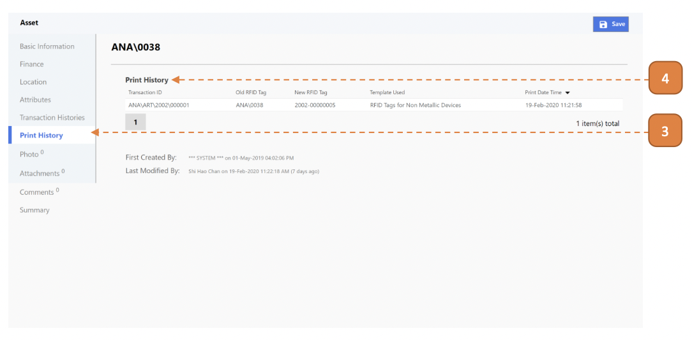

# For Asset Manager

## How do I Check Print History for an Asset?

> Navigate to: **Asset > Asset Listing**

1. Search for an Asset.

2. Enter the Asset Record.

3. Select the **Print History** tab.

4. Under the **Print History** header, you will find the history of tag prints for this asset.

