# For Custodians

## How do I Retag an Asset?

> Navigate to: **Asset > Asset Retagging**

1. Select **New**.

2. Under **"List of Assets"**, select **Add** button.

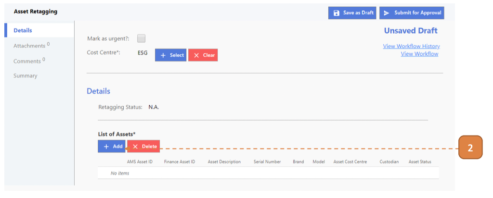

3. Search for the assets for retagging.
Select the search result and select the **Select** button.

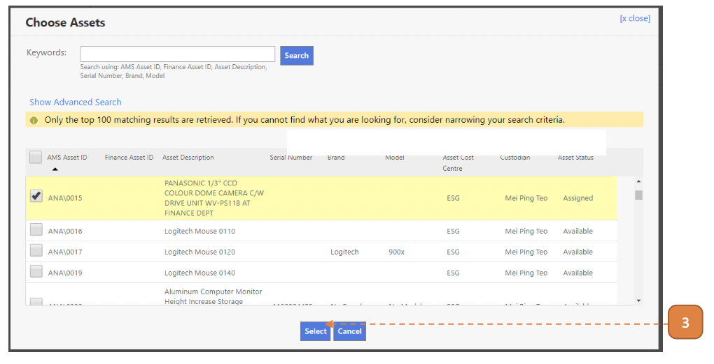

4. Select **Submit for Approval**.

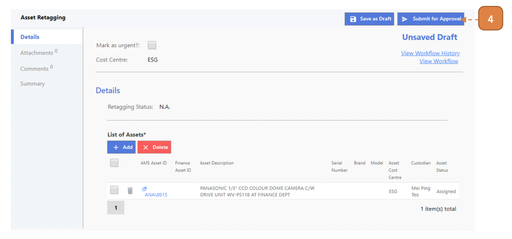

5. Select **Confirm**.

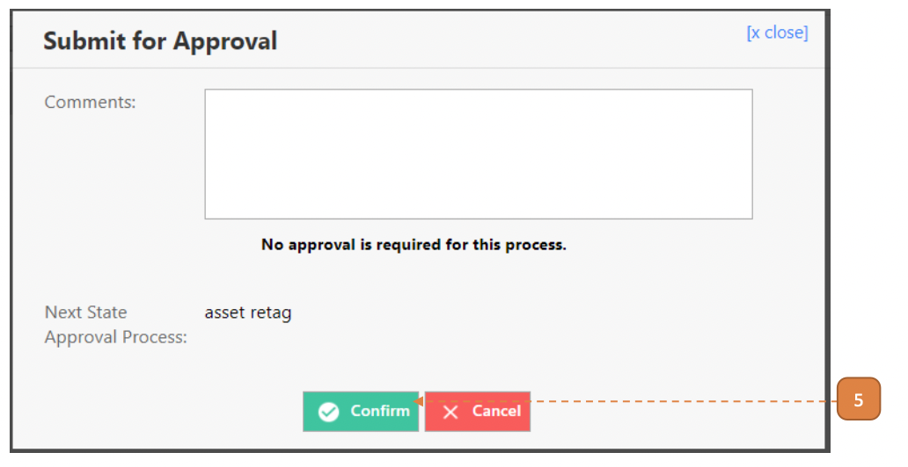

## How do I Retag an Asset Using Excel Upload?

> Navigate to: **Asset > Asset Retagging**

1. Select **Download Upload Template File for Asset Retagging**.

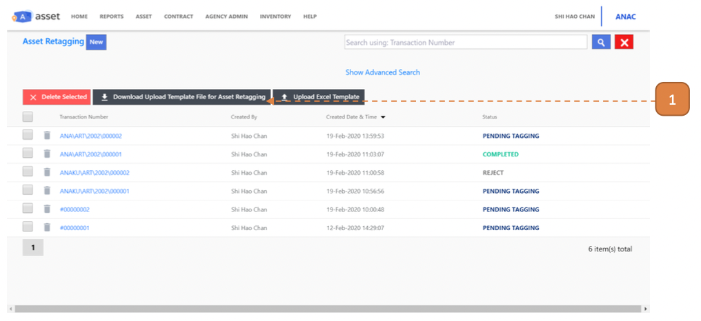

2. Open the downloaded Excel file (Selection to opening the file may depend on browser).

3. In the **Upload Asset Retagging** worksheet, enter the **"AMS Asset ID"**.

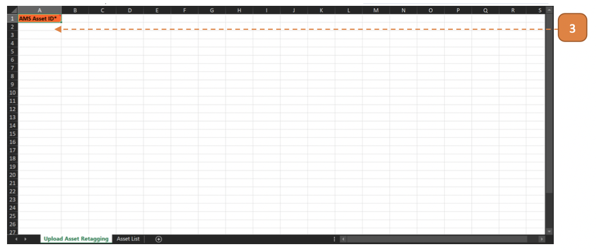

4. You may refer to the **Master Data** worksheet in the image below:

- How to refer to Master Data Example:

- You may enter any assets indicated in the “AMS Asset ID” column, eg: ANA\0002, ANA\0019, ANA\0020, etc.

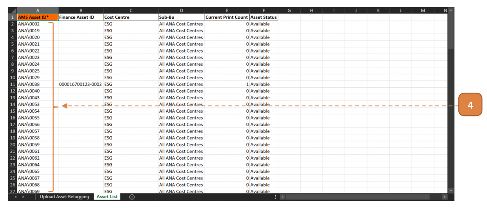

5. Enter the mandatory fields denoted by the orange column header.

- In the example image, ANA\0002 and ANA\0019 were to undergo retag.

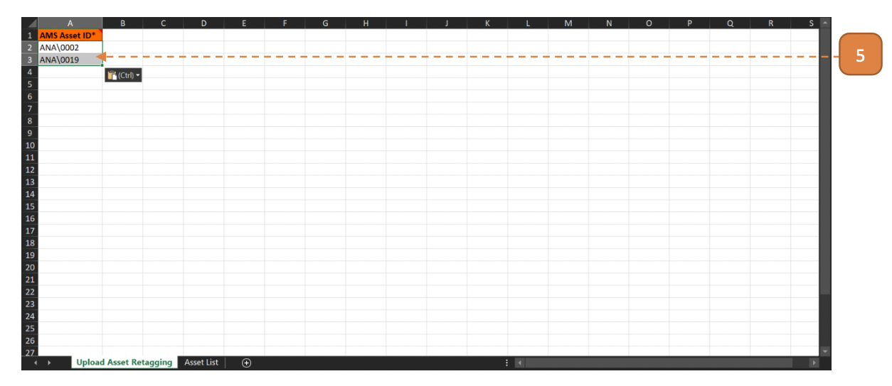

6. Save the Excel file.
Return to the webpage and select **Upload Excel Template**.

7. Select **Choose File**.

8. Select **Upload**.

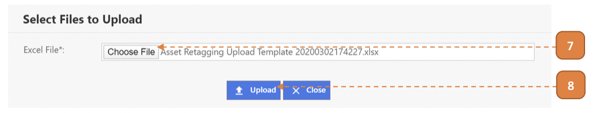

Once the upload is confirmed, the system will check the Excel records for errors. 

When this validation is complete, a summary is shown.

9. If **no critical errors/warnings are found**, select **Confirm to Proceed**.

10. Otherwise, select **Download Validated Excel**.

- The first 2 columns on the validated worksheet will describe the critical errors/warnings that is present in the line item such as “[AMS Asset ID] cannot be found.”

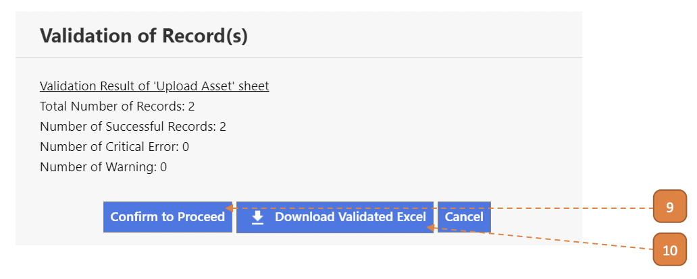

11. Select the **Close** button.

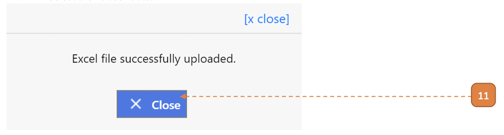

12. A new transaction will be created and saved in draft state.

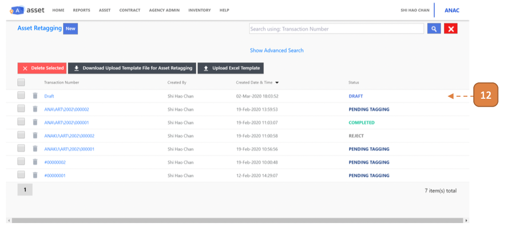

13. Open the transaction, the records from the Excel should be populated here.

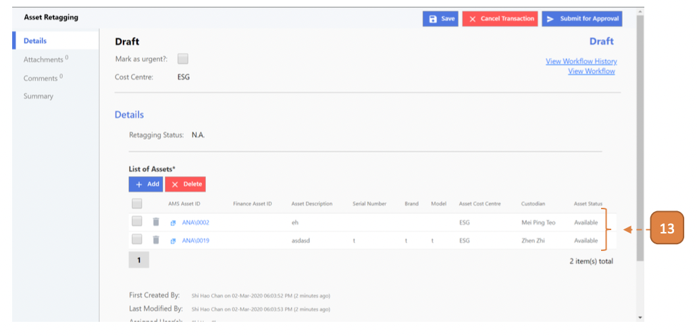

14. Select **Confirm**.

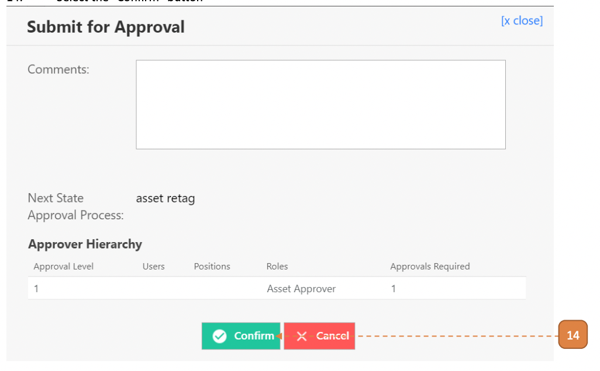