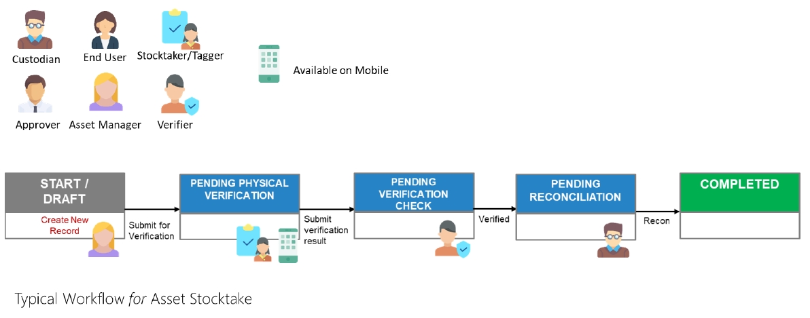

# Asset Stocktake

A stocktake is a session made to **review the status and general condition of an asset**.

A Stocktake process is initiated by the **Asset Manager**, and for the assets under his/her charge.
He/she first selects the pool of assets that shall be involved in the stock take.

For the **selected pool**, the Asset Manager may select whether the stocktake shall be a full stocktake or a partial stocktake.
If **partial**, he/she may enter the percentage of which the system shall randomly pick from the pool.

Click on your respective role(s) to take you through the asset stocktake process:
- [Asset Managers](ASForAssetManagersCreate)

- [Stocktakers](ASForStocktakers)

- [Stocktake Verifiers](ASForStocktakeVerifiers)

- [Custodians](ASForCustodians)