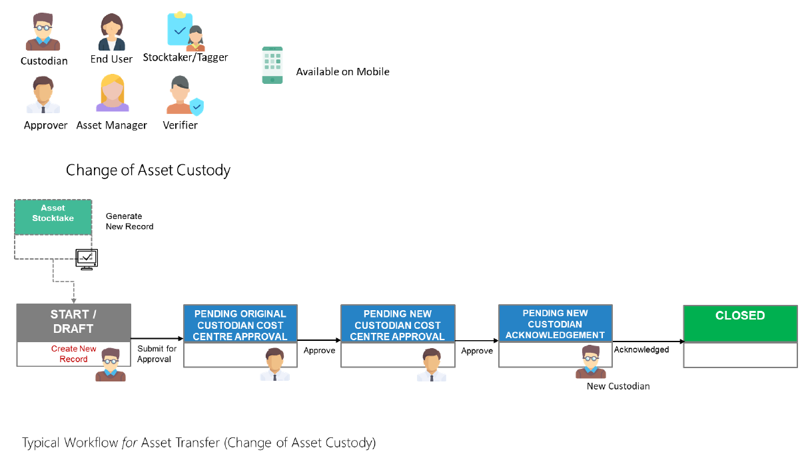

# Asset Transfer

The function of an Asset Transfer is to transfer the custodianship of the Asset, it may be performed between custodians of the same or different cost centres.

Click on your respective role(s) to take you through the Asset Transfer process:
- [Custodians](ATForCustodians.md)

- [Asset Approvers](ATForAssetApprovers.md)