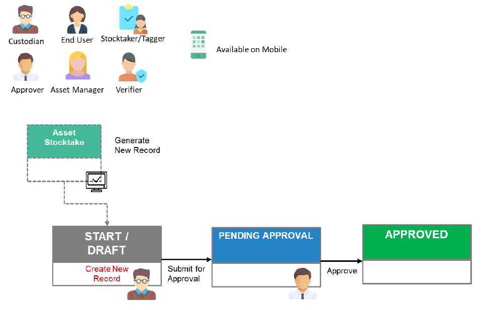

# Asset Update

The function of an Asset Update is to allow custodians to make updates to assets details under their custody. 

Depending on an Agency’s policy, some fields may not be updated (such as critical financial information) or requires approval.

Click on your respective role(s) to take you through the Asset Update process:

- [Custodians](AUForCustodians.md)

- [Asset Approvers](AUForAssetApprovers.md)