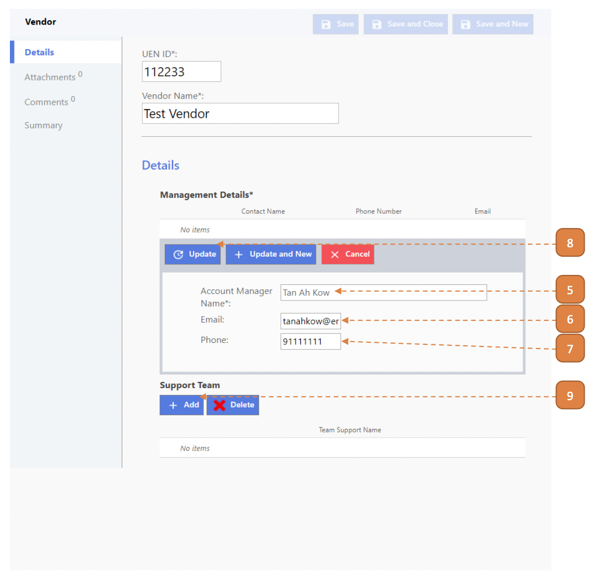
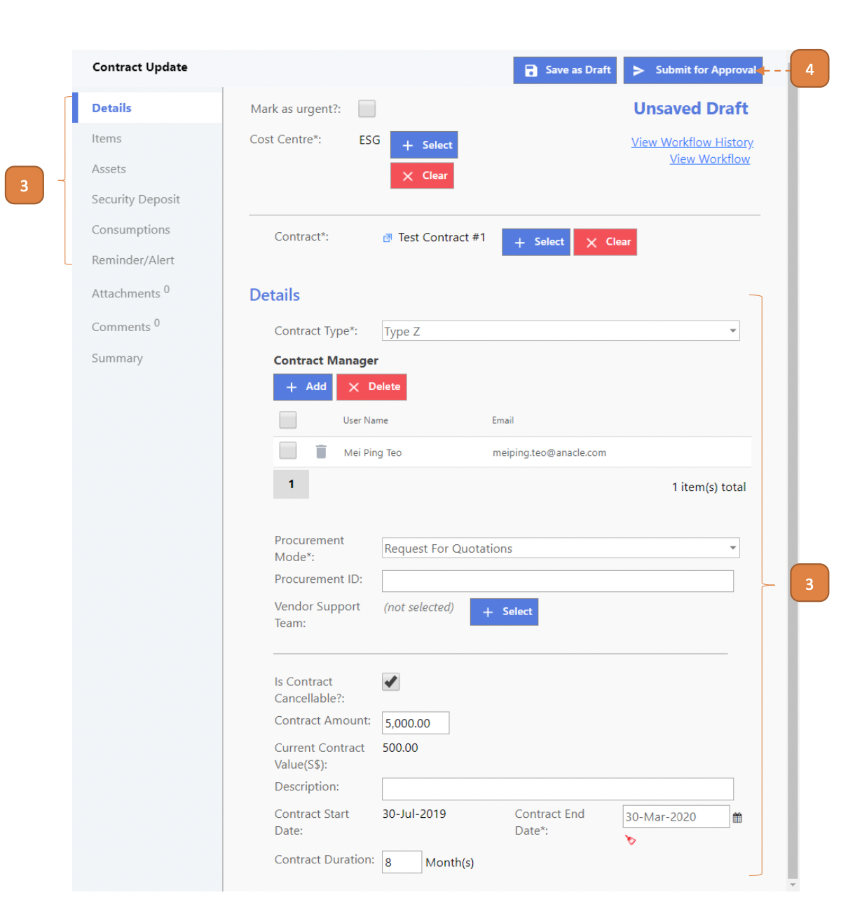

# For Contract Managers

## How do I Create A Vendor?

> Navigate to: **Contract > Vendor Listing**.

1. Select **New**.

2. Enter the **UEN ID**.

3. Enter the **Vendor Name**.

4. Select the **Add** button.

5. Enter the **Account Manager Name**.

6. Enter the **Email**.

7. Enter the **Phone**.

8. Select **Update**.

9. Select **Add**.

10. Enter the **Support Team Name**.

11. Select **Add**.

12. Enter the **Contact Person Name**.

13. Enter the **Email**.

14. Enter the **Phone**.

15. Select the **Update** button.

16. Select the **Update** button.

17. Select **Save and Close**.

## How do I Create A Contract?

> Navigate to: **CONTRACT > Asset Contract**.

1. Select **New**.

2. Select the **Cost Centre**.

3. Enter the **Contract Name**.

4. Enter the **Contract Number**.

5. Select the **Contract Type**.

6. Under the **“Contract Manager”** header, select **Add** to search for the contract manager.

7. Select the **Procurement Mode**.

8. Under the **Vendor Support Team** label, select the **Select** button to search for the Vendor.

9. Under the **Is Contract Cancellable** label, select the checkbox if applicable.

10. Enter the **Approved Procurement Value**.

11. Select the **Contract Start Date**.

12. Select the **Contract End Date** or enter the **Contract Duration**.

13. Select the **Item** tab.

14. Select **Add**.

15. Enter the **Contract Item Name**.

16. Enter the **Contract Item ID**.

17. Enter the **Description**.

18. Select the **Type**.

19. Enter the **Total Value**.

20. Select **Update**.

21. Select the **Assets** tab.

22. Under **“Asset(s) in Contract”** header, select the **Add** to search for the asset.

23. Select the **Security Deposit** tab.

24. Select **Add**.

25. Enter the **Deposit Description**.

26. Enter the **Security Deposit ID**.

27. Enter the **Amount**.

28. Enter the **Organisation Issuing**.

29. Select **Update**.

30. Select the **Reminder/Alert** tab.

31. Select **Add**.

Under **Type** label, select either “Time” or “Threshold”. 
If “Time” is selected, skip Steps 35-37. 
If “Threshold” is selected, skip Steps 32-34.

32. Under **Type** label, select **“Time”** radio button.

33. Under **“Category”**, select one of the 3 options: “Contract Expiry”, “Contractual Items Expiry”, “Security Deposit Expiry”.

34. Under **Parameter**, enter the “Month(s) Before Expiry”.

35. Under **Type** label, select **"Threshold"** radio button.

36. Under **“Category”**, select one of the 2 options: “% of APC Awarded”, “% of Contractual Item consumed”.

37. Under **Parameter**, enter the “% Threshold”.

38. Select **Update** button.

39. Select **Submit for Approval**.

## How do I Perform A Contract Update?

> Navigate to: **CONTRACT > Contract Update**.

1. Select **New**.

2. Under **Contract** label, select the **Select** button and search for the contract.

3. Edit the fields as required.

4. Select **Submit for Approval**.

## How do I Perform A Contract Variation?

> Navigate to: **CONTRACT > Contract Variation**.

1. Select **New**.

2. Under **Contract** label, select the **Select** button and search for the contract.

3. Edit the fields as required.

4. Select **Submit for Approval**.

## How do I Perform A Contract Expiry?

> Navigate to: **CONTRACT > Asset Contract**.

1. Select an existing **"ACTIVE"** contract record.

2. Select **Submit for Expiry Approval** and confirm.

## How do I Perform A Contract Termination?

> Navigate to: **CONTRACT > Asset Contract**.

1. Select an existing **"ACTIVE"** contract record.

2. Select **Submit for Termination Approval** and confirm.

