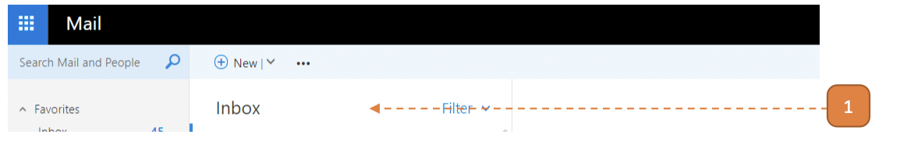
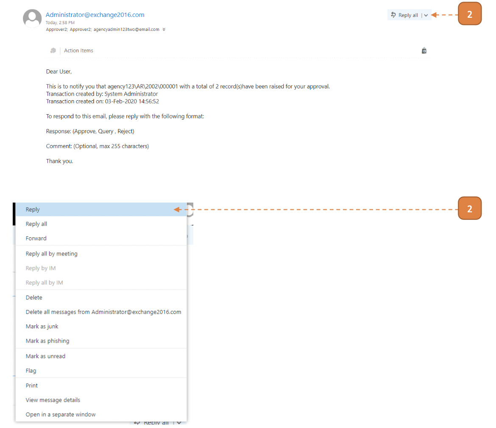
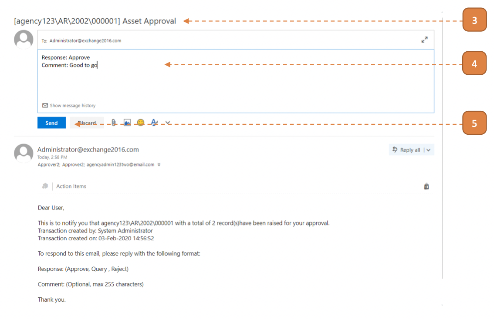

# For Approvers

## How do I Approve via Email?

1. Navigate to Approver's Email.

2. Select **"Reply"**

3. **Note:** For the email subject, it needs to include the following words:

    1. “Asset Approval” or “Asset Transfer” or “Asset Update Approval”
    
    2. The transaction number encapsulated in “[“ and “]”, i.e. “[GT\AR\2001\00001]”.

4. Enter the reply and for the email body response should be in the following format:

**Response: Approve/Query/Reject** 

**Comment: Comments**

**“Response:” and “Comment:” must be included**

5. Click **Send**.

