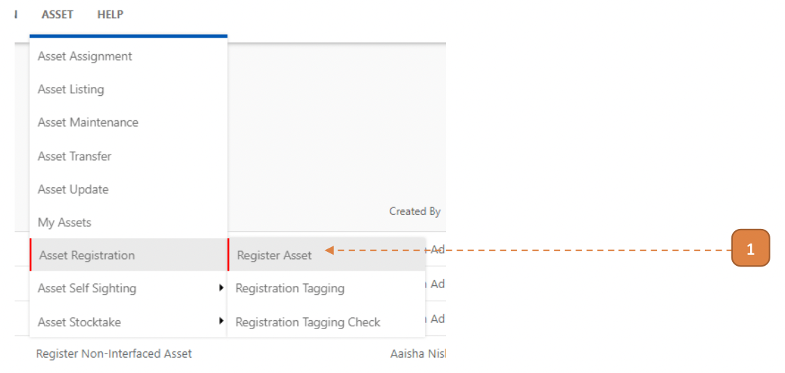
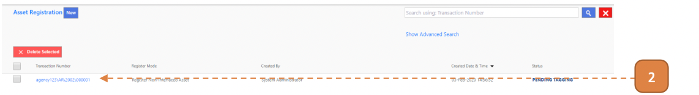
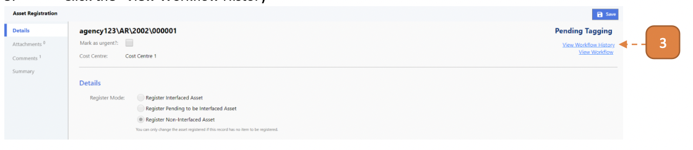
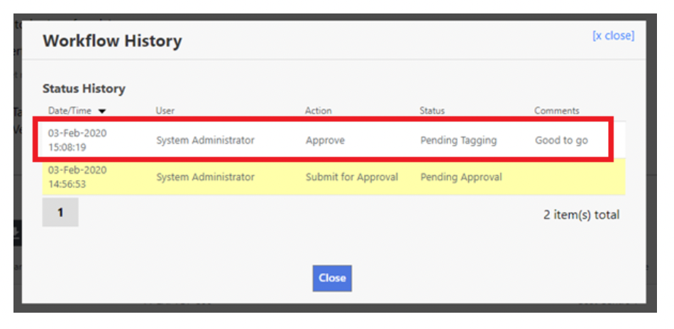

# For Requestors

## How do I Verify if the transaction is Approved/Queried/Rejected?

1. Navigate to the transaction record eg. Asset Registration.

> Asset > Asset Registration > Register Asset

2. Click the transaction number.

3. Click the **"View Workflow History"**.

