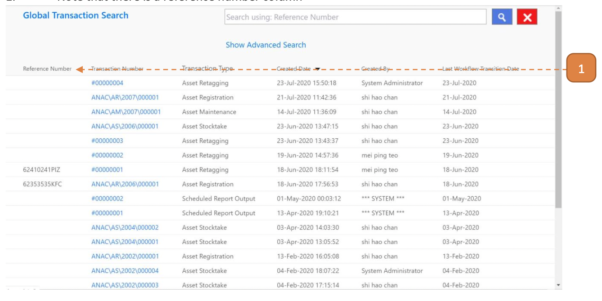
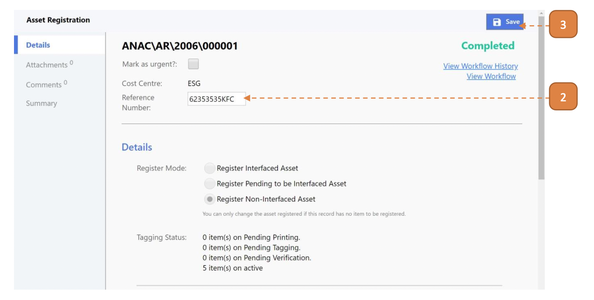
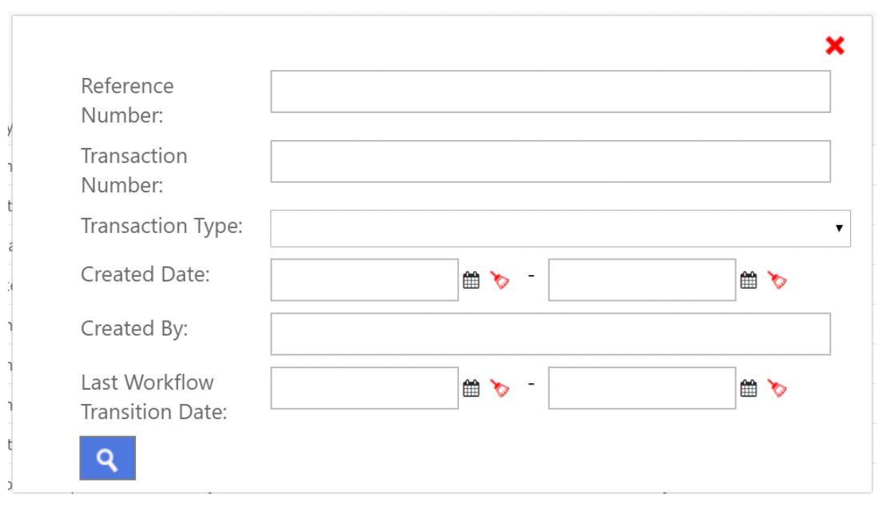

# For Asset Managers & Custodians

## How do I Perform a Global Transaction Search?

> Navigate to: **Asset > Global Transaction Search**

You will find a page of consolidated transactions.

1. Note that there is a reference number column.

Reference number can be found at the top of a transactional record. 
The agency may wish to make use of reference number to search in Global Transaction Search page:

2. In your transaction, enter the Reference Number.

- Example used is Asset Registration. 
Refer to [AssetRegistration](AssetRegistration.md) for more information on how to create an Asset Registration record. 

3. Select **Save**.

- The transaction is now tied to this reference number.

To perform the search on the referenced record, return to Global Transaction Search. 

> Navigate to: **Asset > Global Transaction Search**

4. Enter the reference number.

5. Select the search button.

- The relevant transaction records will appear 

6. Select **"Show Advanced Search"**.

You may use any of the additional filters for search.

