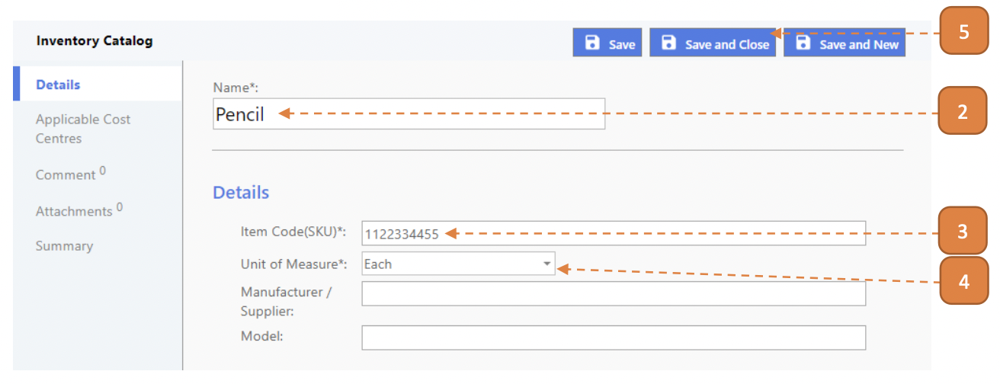

# For Inventory Admin

## How do I Create an Inventory Catalog?

> Navigate to: **Inventory > Inventory Catalog**.

1. Select **New**.

2. Enter the **Name**.

3. Enter the **Item Code(SKU)**.

4. Select the **Unit of Measure**.

5. Select **Save and Close**.

