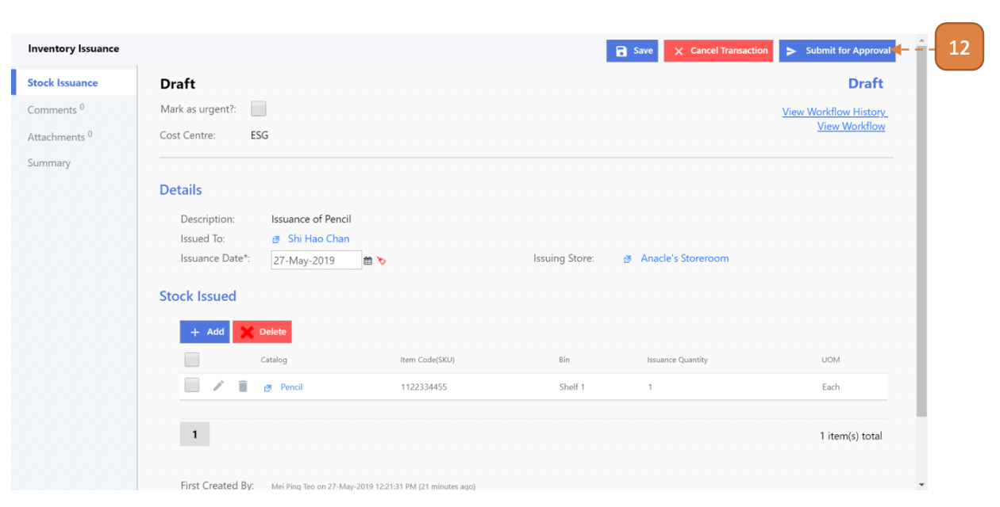

# For Inventory Admin

## How do I Issue an Inventory from Store?

> Navigate to: **Inventory > Inventory Issuance**.

1. Select **New**.

2. Enter the **Description**.

3. Select the **Issued To** button.

4. Select the **Issuance Date**.

5. Select the **Issuing Store**.

6. Under “Stock Issued” header, select **Add**.

7. Select the **Catalog Item**.

8. Select the **Bin**.

9. Enter the **Issuance Quantity**.

10. Select the **Stock Issuance Unit**.
11. Select **Update**.

12. Select **Submit for Approval**.

13. Select **Confirm**.

## How do I Commit an Inventory Issuance from Store?

> Navigate to: **Inventory > Inventory Issuance**.

1. Select the relevant record by selecting the transaction ID.

2. Select **Commit**.

