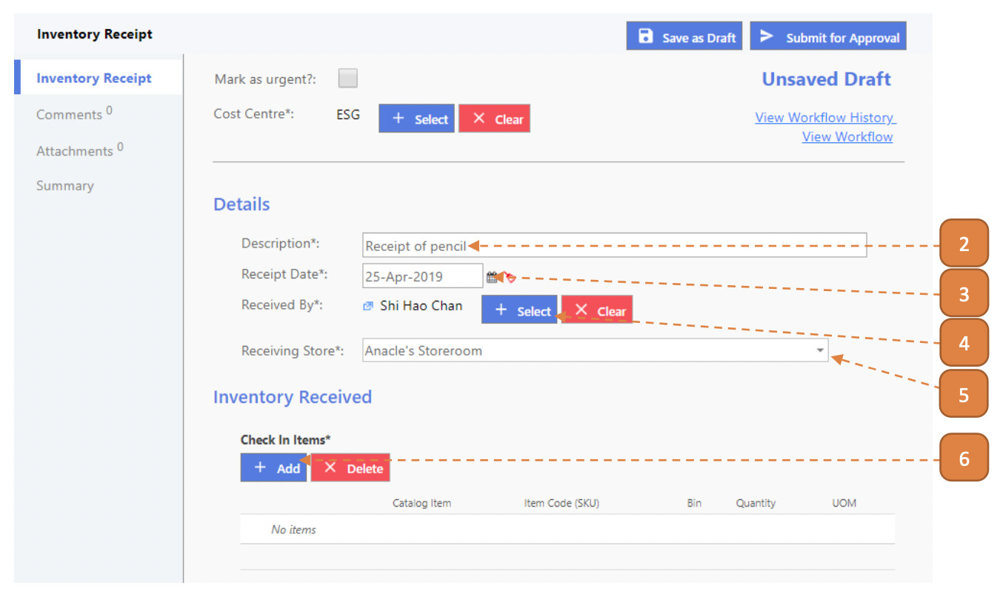
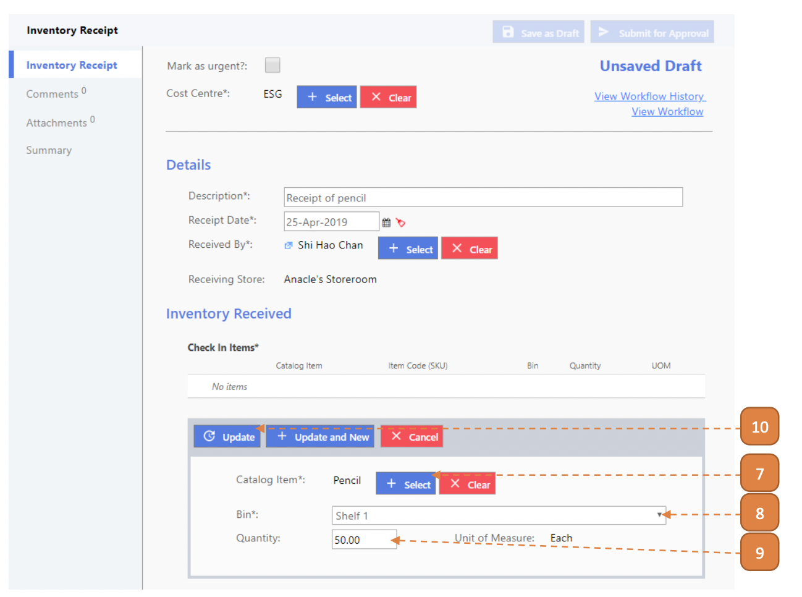
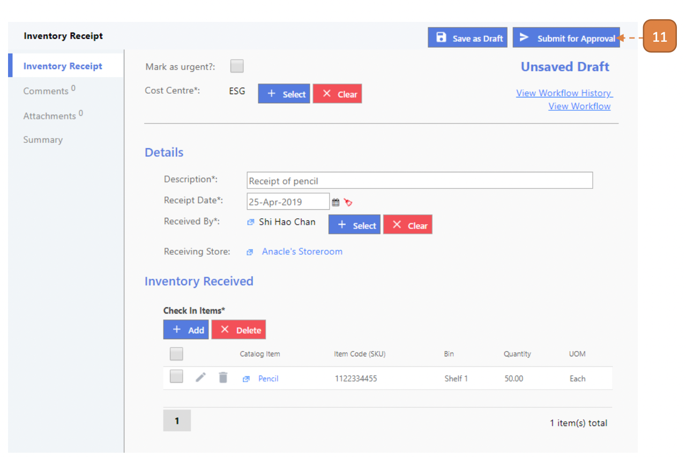
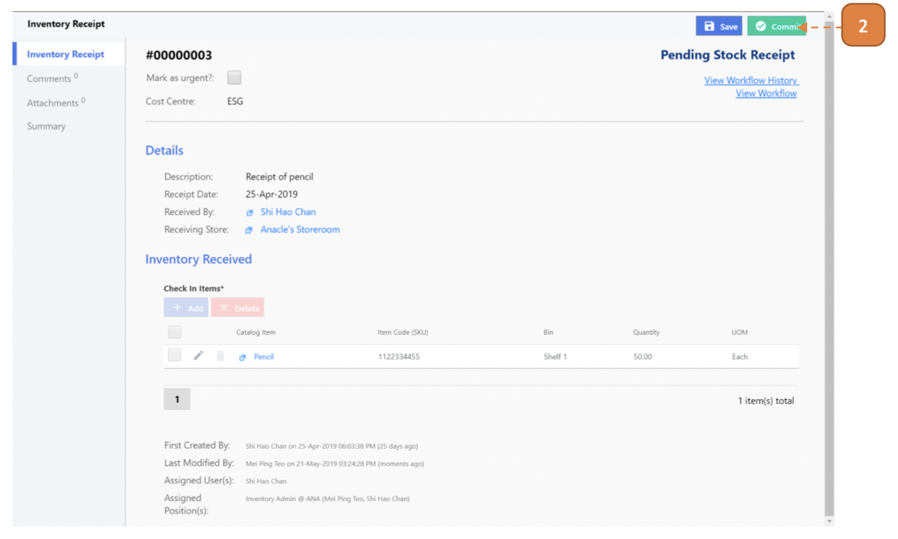

# For Inventory Admin

## How do I Submit an Inventory Receipt for Approval?

> Navigate to: **Inventory > Inventory Receipt**.

1. Select **New**.

2. Enter the **Description**.

3. Select the **Receipt Date**.

4. Select **Received By** user.

5. Select the **Receiving Store**.

6. Select **Add**.

7. Select the **Catalog Item**.

8. Select the **Bin**.

9. Enter the **Quantity**.

10. Select **Update**.

11. Select **Submit for Approval**.

12. Select **Confirm**.

## How do I Commit an Inventory Receipt to Store?

> Navigate to: **Inventory > Inventory Receipt**.

1. Select the relevant record by selecting the transaction ID.

2. Select **Commit**.

