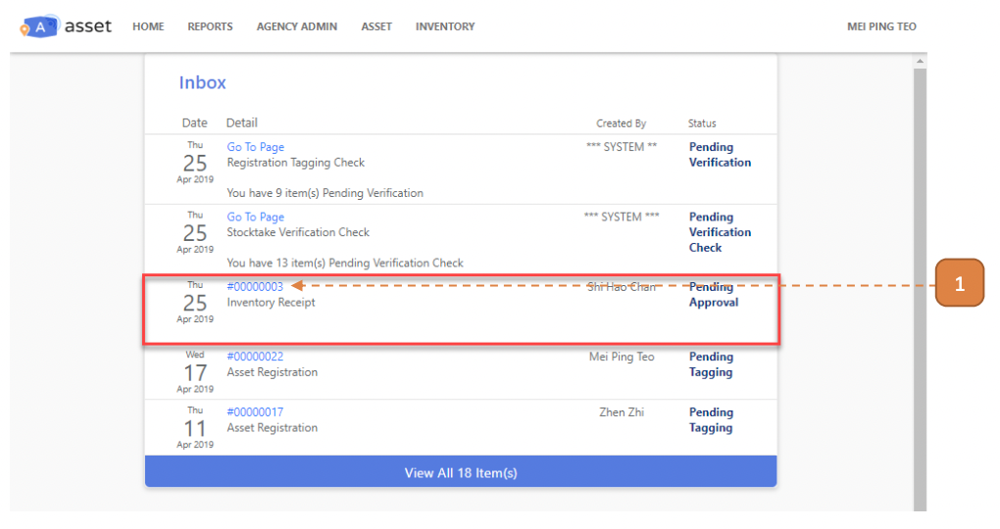
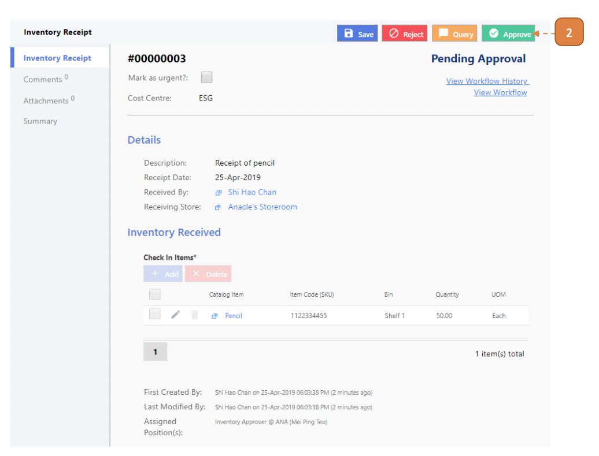

# For Inventory Approvers

## How do I Approve an Inventory Receipt Record?

> Navigate to **Home**. View your inbox, these are all your **pending tasks**.

1. Select the transaction for your approval by selecting the link in **blue**.

- In this case, it’s #00000003.

2. Select **Approve**.

3. Select **Confirm**.

