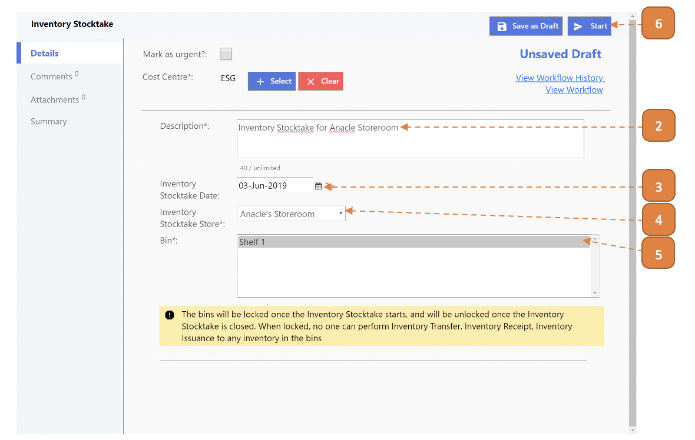
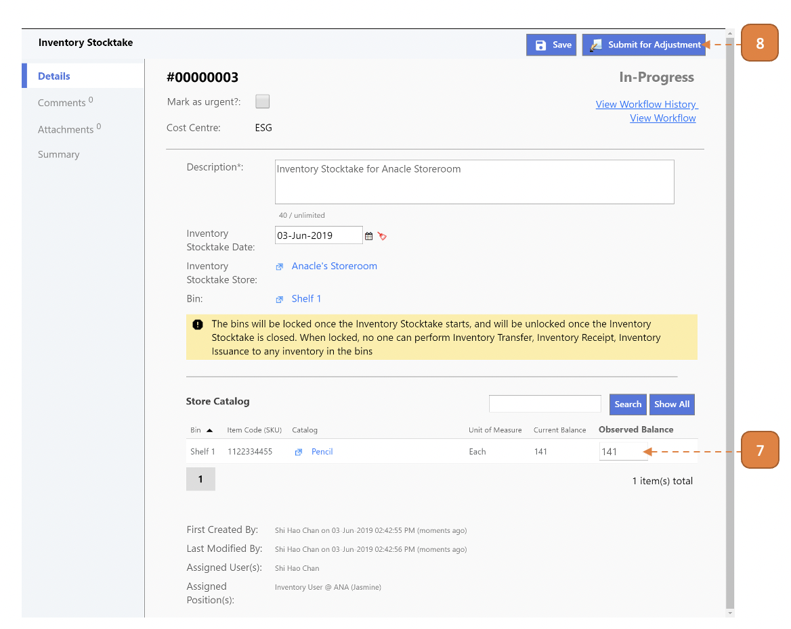
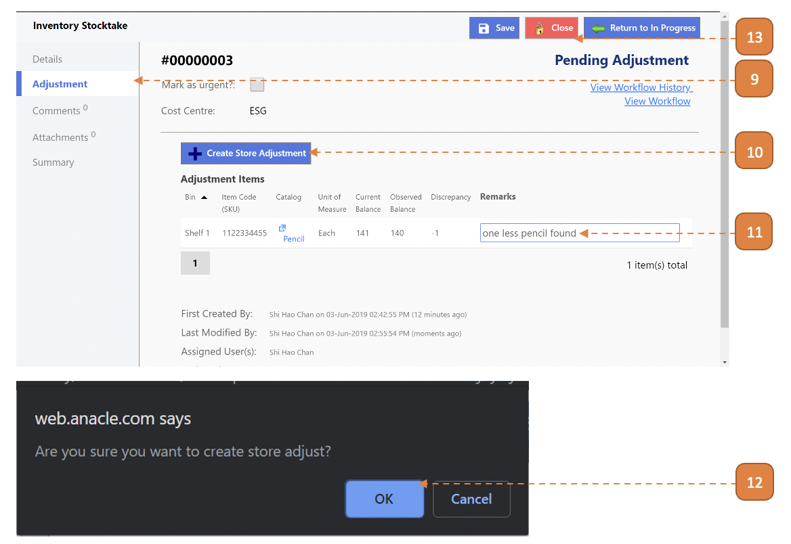

# For Inventory Admin

## How do I Perform an Inventory Stocktake?

> Navigate to: **Inventory > Inventory Stocktake**.

1. Select **New**.

2. Enter the **Description**.

3. Select the **Inventory Stocktake Date**.

4. Select the **Inventory Stocktake Store**.

5. Select the **Bin**.

6. Select the **Start** button.
Note that once stocktake has been initiated, no incoming or outgoing transactions are permitted for the store.

7. Perform stocktaking on the inventory,

- If **“Current Balance” tallies with the “Observed Balance”**, no action is required in this field.

    - Skip Steps 9,10,11,12.

- If **“Current Balance” does not match the “Observed Balance”**, update the “Observed Balance”.

8. Select the **Submit for Adjustment** button.

9. Select the **Adjustment** tab.

10. Enter the **Remarks** field.

11. Select the **Create Store Adjustment** button.

12. Select the **OK** prompt by your web browser, this will save the current stocktake transaction and automatically generate an Inventory Adjustment transaction, refer to [Inventory Adjustment](InventoryAdjustment) for more information.

13. Return to applicable stocktake transaction and select **Close**.

