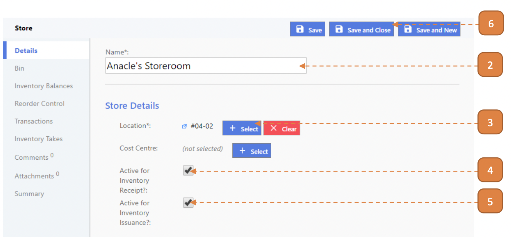

# For Inventory Admin

## How do I Create an Inventory Store?

> Navigate to: **Inventory > Inventory Store**.

1. Select **New**.

2. Enter the **Name** of the store.

3. Select the **Location**.

4. Check the **Active for Inventory Receipt**.

5. Check the **Active for Inventory Issuance**.

6. Select **Save and Close**.

