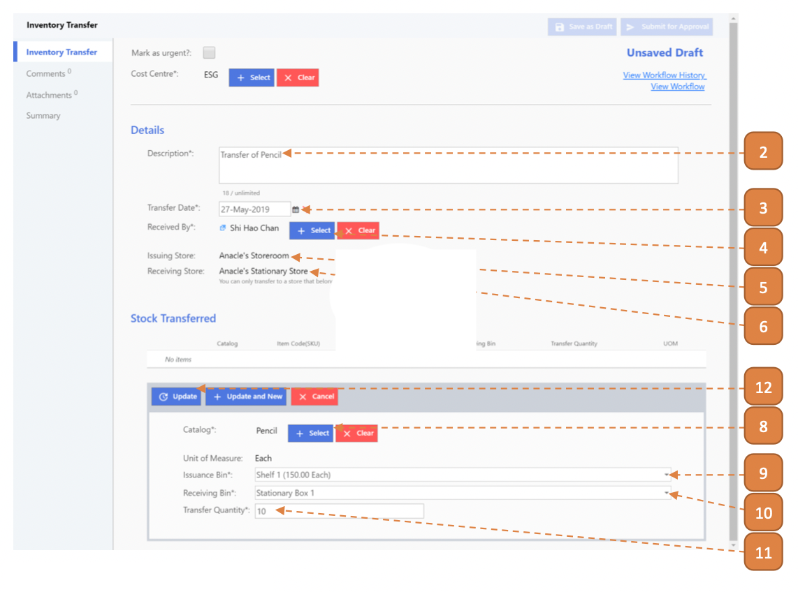
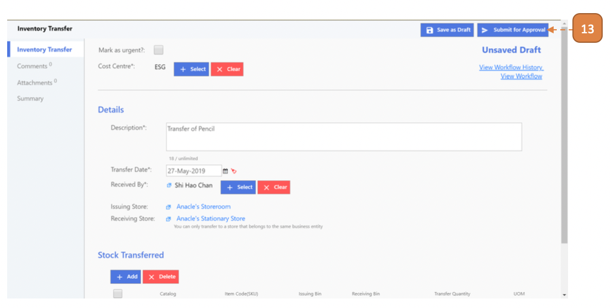
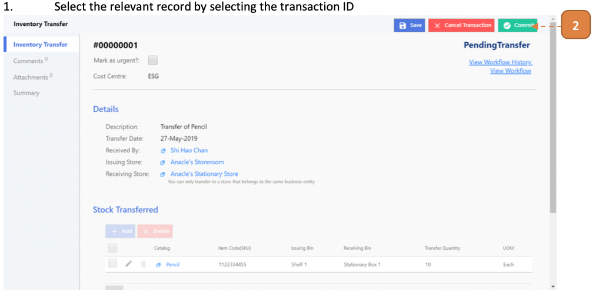

# For Inventory Admin

## How do I Transfer an Inventory from Store to Store?

> Navigate to: **Inventory > Inventory Transfer**.

1. Select **New**.

2. Enter the **Description**.

3. Select the **Transfer Date**.

4. Select the **Received By** user.

5. Select the **Issuing Store**.

6. Select the **Receiving Store**.

7. Under Stock Transferred, select **New**.

8. Select the **Catalog**.

9. Select the **Issuance Bin**.

10. Select the **Receiving Bin**.

11. Enter the **Transfer Quantity**.

12. Select the **Update** button.

13. Select **Submit for Approval**.

14. Select **Confirm**.

## How do I Commit an Inventory Issuance from Store?

> Navigate to: **Inventory > Inventory Transfer**.

1. Select the relevant record by selecting the Transaction ID.

2. Select **Commit**.

