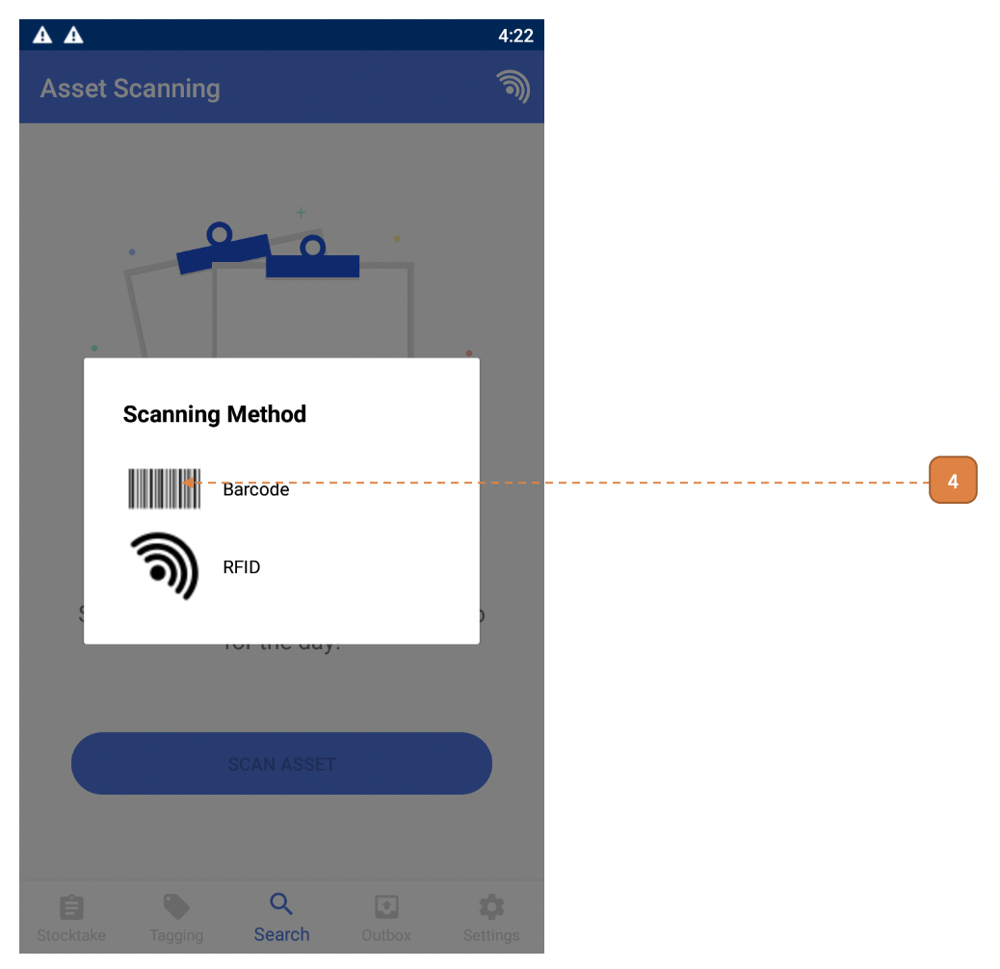

# For Asset Manager & Custodians

## How do I Search for Assets?

1. Select the **Search** icon on the navigation bar.

- If it’s your first time logging in, the tagging list will be empty. 

2. Select the **SCAN ASSET**.

3. You may subsequently select the radar icon to refresh the listing.

4. Under “Scanning Method”, you may select “Barcode” or “RFID”.

- **Barcode:** Camera live view will appear, hover over either QR or barcode to scan. 
Select the back button to stop scanning.

- **RFID:** The scanner will become active, when a tag is detected, an audible beep sound will be heard. 
Select the stop button to stop scanning.

5. After scanning, the results will appear.
Select the record.

6. You can view the asset information here (where available).

