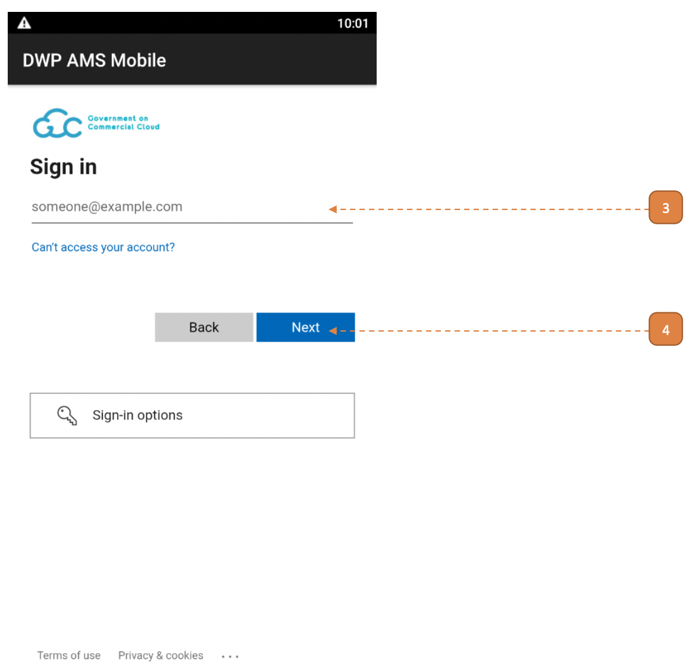

# For Custodians, Taggers, Stocktakers

## How do I Login?

Note: Please register your SOE email with the Microsoft Authenticator mobile app.
Failing to do so will result in an error page when attempting to login.
Please contact your AFM to reset your 2FA or if you encounter issues with **step 3 or 4**.

1. Open the DWP AMS Mobile app.

2. Select the **LOGIN** button.

3. Enter your SOE email.

Note: Please register your SOE email with the Microsoft Authenticator mobile app.
Failing to do so will result in an error page when attempting to login.
Please contact your AFM to reset your 2FA or if you encounter issues in this or the next step.

4. Select **Next** and proceed to enter your key found on the Microsoft Authenticator mobile app.

