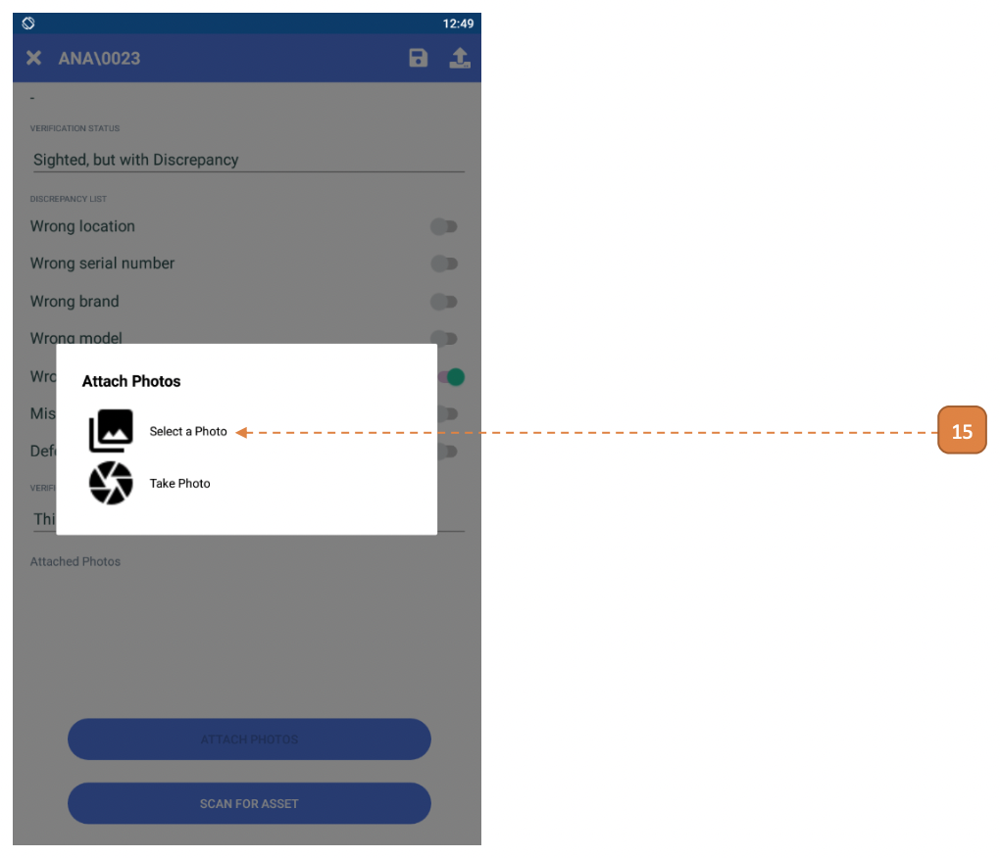

# For Stocktakers

## How do I Perform Stocktake? (Mobile Version)

1. Select the **Stocktake** icon on the navigation bar.

- If it's your first time logging in, the tagging list will be empty.

2. Select DOWNLOAD TAGGING LIST.

3. You may subsequently select the download icon to refresh the listing.

The assets for stocktaking will be listed.

For this case, we will be manually verifying an asset and reporting it as “Sighted”.

4. Select the asset tile.

5. Verify that the asset details are accurate. 
Select on **“VERIFICATION STATUS”**.

6. Select **"Sighted"**.

7. Select the **Upload** icon.

8. Select **OK**.

Note that the successsfully verified items will be cleared from **My Stocktake List**.

9. Select the **Outbox** icon on the navigation bar.
Note that the verified item has successfully been submitted to the system.

10. For this case, we will be manually verifying an asset and reporting it as **"Sighted but with discrepancy"**. 
Select the asset tile.

11. Select the “VERIFICATION STATUS” as **“Sighted, but with Discrepancy”**.

12. Select the type of discrepancy.

- In this case, “Wrong custodian” is selected.

If “Sighted with Discrepancies” is selected, please note that the system will create the following reconciliation transactions (after stocktake is complete).

- Wrong location?: Asset Update
- Wrong serial number?: Asset Update
- Wrong brand?: Asset Update
- Wrong model?: Asset Update
- Wrong custodian?: Asset Transfer
- Missing/Defaced Tag?: Asset Retagging
- Defective?: Asset Maintenance

13. Enter the **VERIFICATION REMARKS**.

14. Select the **ATTACH PHOTOS** button.

15. Select the mode to "Attach Photos".

- In this case, "Select a Photo" was selected.

16. The image preview will appear. Select the **Save** icon.

Note that when the asset is not submitted to the system, instead it’s saved so that more work can be done on this asset later.

17. Note that the **“Verification Status”** has been updated.

## How do I Perform Scanning Session? (Mobile Version)

1. Select the **Scanning Session** icon.

2. Enter the relevant filters for the scanning session.

- In this case, **“BRAND”** filter was used.

3. Select **START SCANNING SESSION**.

4. Select "RFID" as **"Scanning Method"**.

5. The scanning session will begin, this is denoted by the spinning icon on the top right.

Start sweeping the area to pick up the RFID tags.

There are **3 segments** in this page:

- **Found:** These are RFID tags that are detected and has been identified as part of this scanning session (based on the filters in step 2).

    - In this case, all “Found” items are Logitech assets: ANA\0024, ANA\0025.

- **Not in Session:** These are RFID tags that are detected and has been identified as part of this stocktake but not qualified as part of the session.

    - In this case, all “Not in Session” items are NON Logitech assets: ANA\0026, ANA\0022.

    - ANA\0023 is not part of the scanning session as it has already been manually verified.

- **Not in Stocktake:** These are RFID tags that are detected and is not part of “My Stocktake List”.

You will note a **beep sound** for every “Found” tag.

The assets will be dynamically updated to the page.

6. Select the **Stop** icon.

7. You may still manually update the verification status at this point, select the asset tile.

- Refer to [Perform Stocktake](MobileFS.md), **steps 4, 5, 6** on how to update the verification status of an asset.

8. Select **"SUBMIT"**.

- This will submit all assets in this segment, including the assets that has been manually updated.

9. Select **CONFIRM**.

10. Select **OK**.

11. Select the **Outbox** icon on the navigation bar.

Note that the verified item has successfully been submitted to the system.

Note that the successfully verified items will be cleared from **My Stocktake List**.

