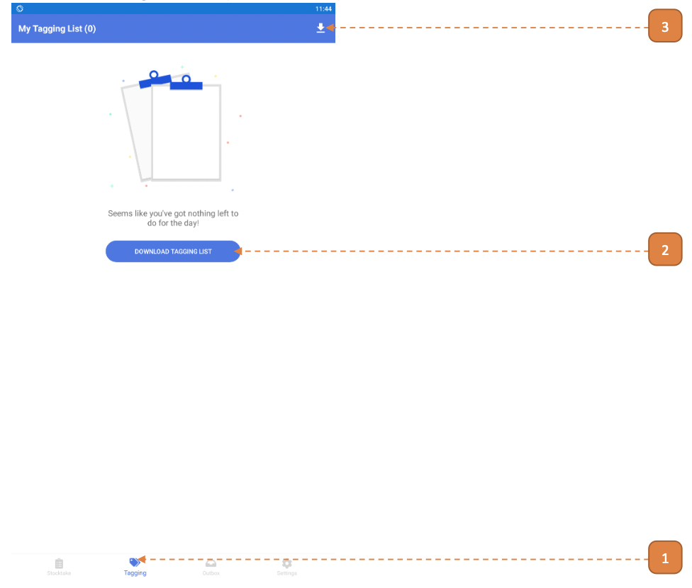

# For Tagging

## How do I Tag an Asset? (Mobile Version)

1. Select the **Tagging** icon on the navigation bar.

- If it’s your first time logging in, the tagging list will be empty. 

2. Select **DOWNLOAD TAGGING LIST**.

3. You may subsequently select the download icon to refresh the listing.

After the download has been processed, you will see a message box **“Tagging list downloaded”**.

4. Select **OK**.

5. The assets for tagging will be listed.
Select the asset tile.

The fields will need to be entered. 
Note that **LOCATION** and **Photo attachment (or “NO PHOTO UPLOAD”)** is mandatory.

6. Select the **Location** field.

7. Select on the Locations applicable. In this case, **“Sandcrawler”** (this is a building) was selected.

8. Select on the Locations applicable. In this case, **“Level 4”** was selected.

- **Note:** If the location you wish to specify is “Sandcrawler”, select “Sandcrawler” in this step instead. 
This will result in this location path.

9. Select on the “Locations” applicable.
In this case, “#04-02” was selected.

- **Note:** If the location you wish to specify is “Level 4”, select “Level 4” in this step instead.

- The full location path is set as “Sandcrawler > Level 4 > #04-02”.

10. Enter the remaining fields.

11. If no photos is applicable for this asset, select the switch **NO PHOTO UPLOAD**. 
If photos are required, skip this step.

12. To attach a photo, select the **ATTACH PHOTOS**.

13. Select the mode to **Attach Photos**.

- In this case, **“Select a Photo”** was selected.

14. The image preview will appear. Select **Upload**.

15. Select **CONFIRM**.

16. Select **OK**.

- **Note:** Successfully tagged items will be cleared from the tagging list.

17. Select the **Outbox** icon on the navigation bar.

Note that the tagged item has successfully been submitted to the system.

## How do I Encode a Tag? (Mobile Version)

> Outdoor tags may be encoded with this method.

1. Select the **Tagging** icon on the navigation bar.

- If it’s your first time logging in, the tagging list will be empty.

2. Select the **DOWNLOAD TAGGING LIST**.

3. You may subsequently select the download icon to refresh the listing.

4. After the download has been processed, you will see a message box “Tagging list downloaded”.
Select **OK**.

The assets for tagging will be listed.

5. Records marked as **“Pending Printing”** will be encodable.

6. Select the asset tile

7. Ensure that the RFID Scanner is physically attached to the Android Phone’s audio jack.

- Configuration may be required, wait for it to be completed. 
If configuration fails, charge the scanner.

8. Rest one tag on scanner. 
Ensure that there is no nearby tags to prevent interference.

9. Select the **ENCODE**. 
If button is disabled, please check with your Agency’s printing personnel if the tags has already been printed.

10. Page will show that tag is found once tag is detected. 
If not, wave the tag over the scanner. 
Select confirm to encode.

- Once successfully encoded, go back to the tagging page. 
If page shows fail to encode, try again. 
If it fails the next attempt, charge the scanner.

11. Next, the tag will be checked if it has been encoded properly. 

    Select **SCAN FOR TAGGING**.

12. Select **RFID**.

13. If the tag is properly encoded, it will show tag found. 
If tag cannot be found, try from **step 7** again.

