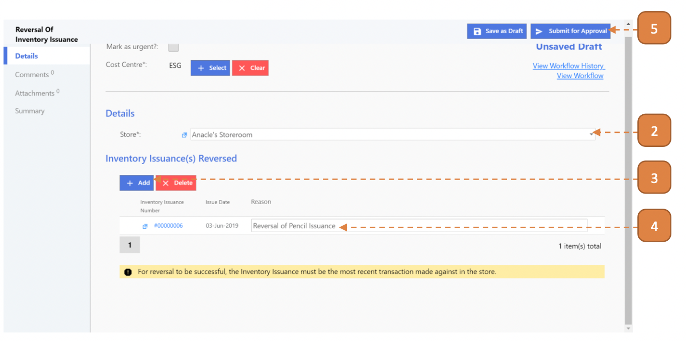

# For Inventory Admin

## How do I Undo an Issuance?

> Navigate to: **Inventory > Reversal Of Inventory Issuance**.

1. Select **New**.

2. Select the **Store**.

3. Under the **“Inventory Issuance(s) Reversed”** header, select the **Add** button and select the relevant record.

4. In the record, enter the **Reason** remarks.

5. Select **Submit for Approval**.

