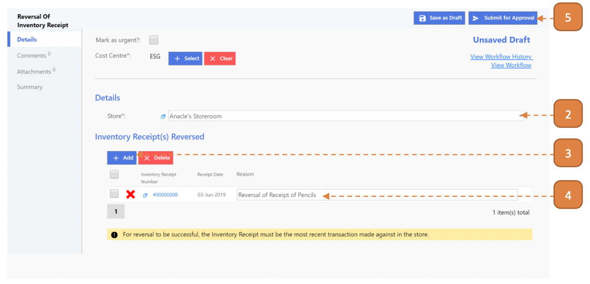

# For Inventory Admin

## How do I Undo a Receipt?

> Navigate to: **Inventory > Reversal Of Inventory Receipt**

1. Select **New**.

2. Select the **Store**.

3. Under the **“Inventory Receipt(s) Reversed”** header, select the **Add** button and select the relevant record.

4. In the record, enter the **“Reason”** remarks.

5. Select **Submit for Approval**

